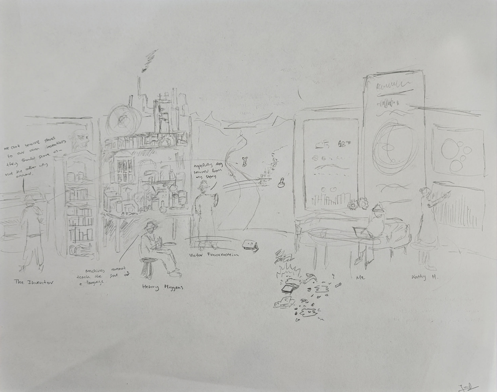

# Visual

## Notes

### Victor Frankenstein:

- From Mary Shelley's Frankenstein
- Highlights ethical implications of scientific advancements
- Victor in Victorian lab
- Emphasizes balancing innovation with ethics
- All the new AI and technology seem pretty relevant to Victor Frankenstein
- Quote: "Hopefully they learned from my story"

### Henry Higgins:

- From George Bernard Shaw's Pygmalion
- Focus on language and social impact
- I actually had a friend who studied Computer Science and Linguistics and Henry Higgins reminds me of him
- Importance of linguistics in AI and communication
- Higgins in English study
- Quote: "Machines cannot teach the soul of a language"

### The Politician:

- From Mark Twain's Cannibalism in the Cars
- Critiques bureaucracy
- Importance of efficient solutions and breaking norms
- Quote: "We can't become slaves to our own inventions; they should serve us—not the other way around"

### Kathy H.:

- From Kazuo Ishiguro's Never Let Me Go
- Explores ethical boundaries of modern science
- Reminder to not get lost in technology
- Kathy in modern, AI-driven smart home
- Encourages balancing technological progress with humanity

### The Setting and Interaction:

- Central feature: diverging roads (inspired by Robert Frost’s The Road Not Taken)
  - There are many different paths to take, especially in the world of technology
- Old technology characters on left throwing objects at new technology characters on right
- Symbolizes resistance to new technologies
- Highlights struggle between tradition and innovation

### Conclusion:

- Characters represent ethical and social implications of technological progress
- Interactions emphasize balancing innovation with ethics, communication, and human values