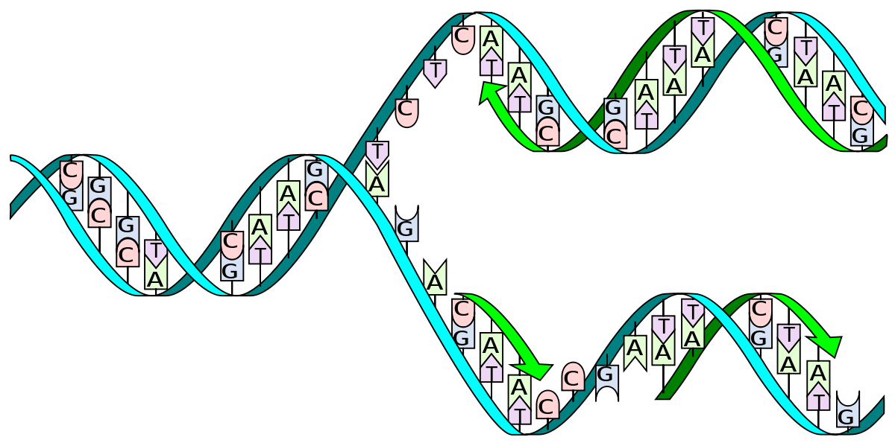
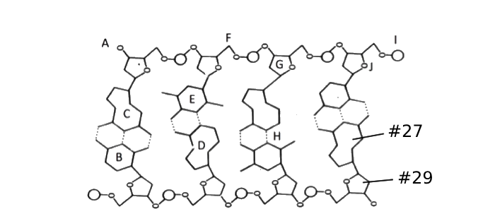

# Module 11 Molecular Genetics Test v1

## Short Answer Questions

1. DNA replication is a process where each strand of a parent DNA molecule serves as a template for a complementary strand in a daughter molecule. The result is two identical DNA molecules. (6 points total)

    

    1. **Draw** an "X" on the diagram above to Indicate where the "replication fork" is. **Label** the leading strand. [1 pt]

        - The replication fork is where the DNA double helix is split into two strands, allowing for the replication of each strand.
        - The leading strand is the strand that is synthesized continuously in the 5' to 3' direction, and in this case, is the top strand depicted in the diagram.

    2. **Name** the specific phase in cell cycle in which DNA replication occurs. **Identify** the number of sister chromatids in a human cell after undergoing DNA replication. [1 pt]

        - DNA replication occurs during the S phase (Synthesis phase) of the cell cycle.
        - After DNA replication, a human cell will have 92 sister chromatids. This is because each of the 46 chromosomes in a human cell is replicated to form two sister chromatids, resulting in a total of 46 pairs or 92 sister chromatids.

    3. **Explain** why DNA replication is known as a "semi-conservative" process. [1 pt]

        DNA replication is known as a "semi-conservative" process because each of the two resulting DNA molecules consists of one original (parental) strand and one new (daughter) strand. This means that half of the parental molecule is conserved in each of the new DNA molecules formed after replication.

    4. **Explain** why the resulting DNA molecule is described to have an "antiparallel" arrangement. [1 pt]

        The resulting DNA molecule is described to have an "antiparallel" arrangement because the two strands of the DNA run in opposite directions relative to each other. This means one strand runs in a 5’ to 3’ direction and the other runs in a 3’ to 5’ direction. This arrangement is crucial for the enzymes that synthesize DNA, as DNA polymerase can only add nucleotides to the 3’ end of the growing strand.

2. For the following question, please write your bases or amino acids with a "-" in between the bases or amino acids. For example, A-T-A or Lys-Tyr-Met. ***Failure to include a "-" results in up to 1-pt deduction.*** [7 points total]

    Dr. Xue found the gene that encodes for spider silk, and he observed that there are variations in the gene alleles that he found. Most of the alleles that he labels as Alpha have the following DNA sequence:

    $\alpha$ allele: 3'-T-C-G-T-A-A-C-C-T-A-C-A-A-T-A-T-G-G-C-T-T-C-G-C-T-A-...-C-A-C-C-G-A-A-T-T-C-G-A-5'

    Transcribe and translate the $\alpha$ allele below: (3 points)

    1. mRNA: A-G-C-A-U-U-G-G-A-U-G-U-U-A-U-A-C-C-G-A-A-G-C-G-U-A-...-G-U-G-G-C-U-U-A-A-G-C-U
    2. Protein: Met-Leu-Tyr-Arg-Ser-Asp-Val-Ala-STOP

    Dr. Xue also found the following four variations. Translate the DNA and identify the specific type of mutations for each variation compared to the $\alpha$ allele. (4 points)

    $\beta$ allele: 3'-T-C-G-T-A-A-C-C-T-A-C-A-A-T-A-T-G-G-C-T-T-C-***A***-C-T-A-...-C-A-C-C-G-A-A-T-T-C-G-A-5'

    1. Protein: Met-Leu-Tyr-Arg-Ser-Agu-Val-Ala-STOP
    2. Mutation: Substitution, Silent

    $\chi$ allele: 3'-T-C-G-T-A-A-C-C-T-A-C-A-AT-A-T-G-G-C-T-T-C-G-C-T-A-C-A-C-C-G-A-A-T-***G***-T-C-G-A-5'

    1. Protein: Met-Leu-Tyr-Arg-Ser-Asp-Val-Ala-STOP
    2. Mutation: Insert Frameshift, Silent

    $\delta$ allele: 3'-T-C-G-T-A-A-C-C-T-A-C-A-A-T-A-T-***C***-G-C-T-T-C-G-C-T-A-...-C-A-C-C-G-A-A-T-T-C-G-A-5'

    1. Protein: Met-Leu-STOP
    2. Mutation: Substitution, Nonsense

    $\epsilon$ allele: 3'-T-C-G-T-A-A-C-C-T-A-C-A-A-T-A-T-G-G-C-T-T-C-G-C-T-T-...-C-A-C-C-G-A-A-T-T-C-G-A-5'

    1. Protein: Met-Leu-Tyr-Arg-Ser-Glu-Val-Ala-STOP
    2. Mutation: Insert Frameshift, Missense

## Multiple Choice

For the next two questions, use the following diagram:

1. Which structure is #29 pointing to?

    1. **Deoxyribose**
    2. Ribose
    3. Adenine
    4. Guanine
    5. Uracil

2. Which structure is #27 pointing to?

    1. Deoxyribose
    2. Ribose
    3. Adenine
    4. **Guanine**
    5. Uracil

3. In DNA replication, DNA "unwinds" to form two strands: the leading strand and the lagging strand. Which of the following statements is true?

    1. The lagging strand can only be synthesized once the leading strand has been completed.
    2. Okazaki fragments are used to synthesize the leading strand of DNA.
    3. The new DNA strands are synthesized only in the 3'-5' direction.
    4. **The leading strand of DNA is synthesized continuously.**
    5. DNA polymerase can only synthesize DNA on the leading strand.

4. Transcription occurs in the while translation happens with the help of (organelle).

    1. cytoplasm, golgi
    2. nucleus, lysosome
    3. cytoplasm, ribosome
    4. **nucleus, ribosome**
    5. lysosome, smooth endoplasmic reticulum

5. A particular species of fish contains 10% of guanine, how much percentage of adenine is there in its genome?

    1. 10%
    2. 20%
    3. **40%**
    4. 80%
    5. It cannot be determined

6. How many nucleotides are needed, at the minimum, to specify for a protein made up of 500 amino acids?

    1. 500
    2. 503
    3. 1003
    4. **1503**
    5. 1506

7. During the process of translation, the following RNAs are involved [Select all that apply]:

    1. **rRNA**
    2. Primase
    3. RNA polymerase
    4. **mRNA**
    5. **tRNA**

8. A strand of DNA is 3' TAGGCATTGCA 5'. What is the complementary DNA strand that is created from this template during replication?

    1. 5' TGCAATGCCTA 3'
    2. **5' ATCCGTAACGT 3'**
    3. 5' AUCCGUAACGU 3'
    4. 5' TAGGCATTGCA 3'
    5. None of the above

9. How may the redundancy of the genetic code (i.e. more than one codon can code for the same amino acid) be beneficial to organisms?

    1. It ensures that DNA replication is accurate.
    2. It diminishes the chances for cancer cells to grow.
    3. **It enables mutations to be "silent" instead of harmful.**
    4. It improves the efficiency of transcription.
    5. It leads to different amino acids making evolution possible.

10. An mRNA to be translated is 300 nucleotides long, including both start and stop codons. After translation, how many amino acids does the completed protein have?

    1. **99**
    2. 100
    3. 101
    4. 300
    5. 903

11. Which of the following is/are TRUE? [Select all that apply]

    1. **RNA is usually single stranded**
    2. DNA is usually single stranded
    3. DNA contains ribose sugar
    4. DNA contains uracil
    5. **RNA contains adenine**

12. The tRNA with an anticodon "ACU" would carry the amino acid _.

    1. Phenylalanine
    2. Serine
    3. **Threonine**
    4. Tryptophan
    5. none of the above, because it is a stop codon

13. The sequence "CGA" on the DNA template strand sequence will signal for a tRNA carrying the amino acid

    1. Arginine
    2. **Alanine**
    3. Asparagine
    4. Aspartate
    5. None of the above

    Matching the following accomplishment to the correct scientist(s):

    A. Chargaff 
    B. Franklin and Wilkins 
    C. Watson and Crick 
    D. Hershey and Chase 
    E. Tong and Harris 

14. Used X-ray diffraction to show that the DNA molecule is a double helix: **B**
15. Proved that DNA, not proteins, was the genetic material: **D**
16. According to the table below, the percentage of tyrosine in the DNA of the bacterium, *E.coli*:

    | Organism | %A   | %G   |
    |----------|------|------|
    | Human    | 29.3 | 20.7 |
    | Chicken  | 28.0 |      |
    | Rat      | 28.4 | 21.4 |
    | E. coli  |      | 26.9 |

    1. 26.9%
    2. 13.1%
    3. 22.8%
    4. 23.1%
    5. **Cannot be determined**

17. According to the universal genetic code that codes for amino acids in translation for all living things, what does it mean when we say it is specific and non-ambiguous?

    1. Multiple codons can code for the same amino acids.
    2. Some codons must code for termination of translation.
    3. **Every codon codes for either an amino acid or the termination of translation.**
    4. Each codon codes for a different amino acid.
    5. Some amino acids being so similar can be used interchangeably.

18. **Extra Credit.** When a strand of DNA is transcribed and translated, it produces a protein with the following order: ...-Ser-Tyr-Lys-Met-Val-Pro-Met-Leu-... Occasionally, a protein with the following order is found: ...-Ser-Tyr-Lys-Arg-Ile-Thr-Leu-Asp-... What type(s) of mutation(s) would account for such a variation? [Select all possible choices]

    1. Silent mutation
    2. **Insertion frameshift mutation**
    3. **Deleting frameshift mutation**
    4. Missense mutation
    5. Nonsense mutation
