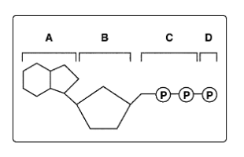
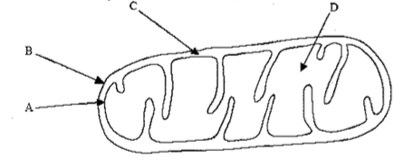
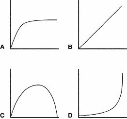
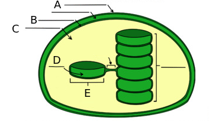
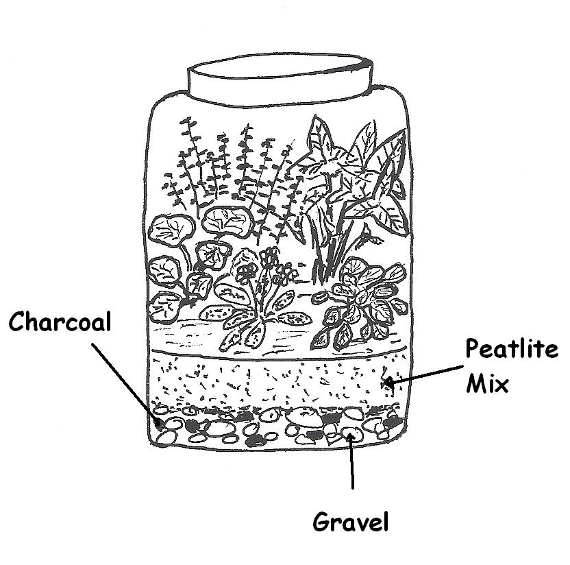

# Module 8 Test: Cellular Energy, Respiration, and Photosynthesis

## Multiple Choice

1. Which of the following is one of the ways that cellular respiration and photosynthesis are opposite processes?

    1. Photosynthesis releases energy, and cellular respiration stores energy.
    2. **Photosynthesis engages in carbon fixation, and cellular respiration engages in carbon release.**
    3. Photosynthesis removes oxygen from the atmosphere, and cellular respiration puts it back.
    4. Photosynthesis consumes glucose, and cellular respiration produces glucose.
    5. Photosynthesis converts light energy to chemical energy, and cellular respiration converts chemical energy to light energy.

2. Which of the following statements is TRUE for both types of fermentation?

    1. **The regeneration of NAD+ allows for glycolysis to continue.**
    2. Pyruvate molecules are broken down into lactic acid.
    3. Oxygen is required as a reactant.
    4. Carbon dioxide is released as a by-product.
    5. The electron transport chain is involved to produce ATP.

3. Look at the figure below. All the following are parts of an ADP molecule except

    

    1. Structure A
    2. Structure B
    3. Structure C
    4. **Structure D**
    5. Both Cand D

4. What process do the arrows for oxygen going in and water coming out represent in the diagram of the mitochondria?

    

    1. **Electron Transport Chain**
    2. Fermentation
    3. Glycolysis
    4. Krebs Cycle
    5. Calvin Cycle

5. Which structure in the mitochondria shown below is where H+ (protons) is transported to create a gradient for ATP synthesis?

    

    1. A
    2. B
    3. **C**
    4. D

6. Imagine that the y-axis of each graph in the figure below represents the rate of photosynthesis and the x-axis represents the temperature from 0°C to 35°C. The optimal water temperature for aquatic plants for photosynthesis is between 25°C and 32°C. Which of the following graphs best represents the effect of water temperature on the rate of photosynthesis in aquatic plants?

    

    1. A
    2. B
    3. **C**
    4. D

7. Correctly order the steps for Electron Transport Chain process in cellular respiration.

    I. Oxygen functions as the electron acceptor in the process. 
    II. The electron carrier molecules bring high energy electrons to protein pumps to transport protons. 
    III. The pumps in the inner membrane transport protons actively to the intermembrane space. 
    IV. H+ ions flow down their concentration gradient through the ATP Synthase to generate ATP. 

    1. IV, II, III, I
    2. **II, III, I, IV**
    3. II, IV, III, I
    4. III, II, I, IV
    5. III, IV, II, I

8. Where in the chloroplast are NADPH and ATP used to begin to modify $CO_2$ into G3P?

    

    1. A
    2. B
    3. **C**
    4. D
    5. E

9. Correctly order the steps for photosynthesis:

    I. $H^+$ ions flow down their concentration gradient through the ATP Synthase to generate ATP. 
    II. The ATP and electron carriers proceed to be used in the light independent reaction. 
    III, $CO_2$ enters the Calvin Cycle with the help of an enzyme and using energy harnessed from light, G3P is made. 
    IV. With light, pigments receive sunlight and hydrolyze water, allowing electrons to create $H^+$ concentration gradient for ATP production. 

    1. II, I, IV, III
    2. I, II, III, IV
    3. II, III, I, IV
    4. **IV, I, II, III**

10. During the light-dependent reaction, which reactants are used?

    I. ADP
    II. NADH
    III. Carbon dioxide
    IV. Water
    V. NADP+
    VI. Oxygen
    VII. NAD+
    VIII. ATP

    1. **I, IV, and V**
    2. I, IV, VII
    3. II, VI, VIII
    4. II, III, VII
    5. III, V, VIII

11. Comparing mitochondria and chloroplast, which of the following statements is/are TRUE? Select all possible choice(s).

    1. Mitochondria has an inner and outer membrane, but chloroplast only has an outer membrane and thylakoid membrane.
    2. **Chloroplast generates a lot of ATP that is used for G3P production, while mitochondria generates a lot of ATP for use as cellular energy.**
    3. Mitochondria and chloroplast have both types of electron transport molecules, NADH/NADPH and $FADH_2$/$FADPH_2$.
    4. **Both mitochondria and chloroplast utilize H+ concentration gradient to create ATP through ATP synthase.**

12. Which of the following statements is/are TRUE about glycolysis? Select all possible choice(s).

    1. **The process does not require oxygen.**
    2. **The process occurs in the cytoplasm.**
    3. The process is the first step of aerobic respiration but not anaerobic respiration.
    4. **The process requires electron carriers to be available.**
    5. **The process occurs in both prokaryotes and eukaryotes.**

13. During the Krebs Cycle process, which reactants are used?

    I. Pyruvate 
    II. ATP 
    III. O2 
    IV. Water 
    V. NADH 
    VI. FADH2 
    VII. NAD+ 
    VIII. FAD+ 

    1. I, II, III
    2. II, IV, V
    3. **I, VII, VIII**
    4. II, III, VI

14. CAM plants close their stomata at night to prevent water loss and maximize CO2 production.

    1. True
    2. **False**

15. Humans are eukaryotes capable of both aerobic and anaerobic respiration.

    1. **True**
    2. False

## Short Answer

The picture below shows a self-sustaining chamber where it is a CLOSED SYSTEM (no exchange of matter outside the chamber).

In the closed chamber, you have plants, some mini snails, and water (in the gravel layer). You purchased three of these closed chambers and decided to do an extensive experiment on them.

1. You want to find out whether photosynthesis will happen faster under red light. This is your experiment's set up:

    Chamber A was left at room temperature (25°C) under regular sunlight. 
    Chamber B was left in a temperature-regulated closet with no light at 25°C. 
    Chamber C was put under a red-light lamp at 25°C. 

    1. Identify the negative control and justify the use of this control in this experiment (1 pt)

        The negative control in this experiment is Chamber B, where the plants were kept in a temperature-regulated closet with no light at the same temperature as the other chambers. This chamber serves as the negative control because it does not receive any light, which is essential for photosynthesis to occur. By comparing the other chambers to this control, you can determine the effect of light presence (sunlight and red light) on the rate of photosynthesis, as Chamber B is expected to have little to no photosynthesis due to the absence of light.

    2. Identify the positive control and justify the use of this control in this experiment (1 pt)

        Chamber A, where the plants were left under regular sunlight at room temperature, serves as the positive control. This setup represents typical conditions under which photosynthesis naturally occurs. By using this chamber as the positive control, it confirms that the experimental conditions are suitable for photosynthesis. Comparing the other chambers to this one helps establish a baseline for how effective regular sunlight is in driving the photosynthetic process compared to red light.

    3. Predict which chamber would have the highest rate of photosynthesis. Explain your prediction. (2 pts)

        I predict that Chamber C, which was exposed to red light, might show the highest rate of photosynthesis among the three setups. Red light is part of the wavelengths that are highly effective in driving photosynthesis. Specifically, red light is absorbed well by chlorophyll pigments, which play a crucial role in the photosynthesis process. Although regular sunlight (as in Chamber A) includes red light among other wavelengths, the concentrated red light in Chamber C could potentially drive a higher rate of photosynthesis by providing an optimized wavelength specific for the absorption peaks of the photosynthetic pigments.

2. On Day 2, your mischievous sibling decided to play a prank on you by taking the chamber that was under the red-light lamp and hiding it in a cabinet in the storage room with night at 15$^\circ$C. You took three days to find the chamber.

    1. Name the photosynthetic reaction that stopped occurring immediately when your siting first hid it. (1 pt)

        When the chamber was moved to a dark cabinet, the light-dependent reactions of photosynthesis would have stopped occurring immediately. These reactions require light to drive the process of converting light energy into chemical energy (ATP and NADPH).

    2. Identify the location within the chloroplast where the photosynthetic reaction you named in Zaj occur. (1 pt)

        The light-dependent reactions occur in the thylakoid membranes of the chloroplast. These membranes house the photosynthetic pigments (like chlorophyll) and the electron transport chain components that are critical for capturing light energy and converting it into chemical energy.

    3. List all the products the photosynthetic reaction you named in 2a) produce? (1 pt)

        In the light-dependent reactions, light energy is used to split water molecules (photolysis), producing oxygen as a by-product. The energy derived from light is then used to convert ADP into ATP and NADP+ into NADPH. These products (ATP and NADPH) are vital for the subsequent light-independent reactions (Calvin cycle) to synthesize glucose.

3. Immediately after you found the chamber, you put it back under regular sunlight and discovered that the mini snails died

    1. Explain why the mini snails might have died. (1 pt)

        The mini snails may have died due to a lack of oxygen and the accumulation of carbon dioxide within the sealed chamber when it was kept in darkness. Normally, plants produce oxygen during the light-dependent reactions of photosynthesis, which requires light. Without light, these reactions ceased, halting oxygen production. Snails rely on oxygen for respiration, and in a sealed environment without fresh oxygen being produced, they likely suffocated from oxygen depletion and possibly also from the buildup of toxic carbon dioxide that they exhaled.

    2. As a result of the death of the mini snails, name the photosynthetic reaction(s) that would be limited. Explain your answer. (2 pts)

        The death of the mini snails would primarily affect the Calvin Cycle, or the light-independent reactions of photosynthesis. Normally, snails respire, releasing carbon dioxide as a waste product, which plants use as a raw material in the Calvin Cycle to synthesize glucose. With the death of the snails, the carbon dioxide level within the chamber would decrease, potentially limiting the availability of CO₂ for the Calvin Cycle. This reduction in CO₂ could restrict the plant's ability to synthesize glucose, thus impacting overall plant health and growth, as the Calvin Cycle depends on a steady supply of carbon dioxide to operate efficiently.

## Extra Credit

1. Say one mole of glucose contains 3000kJ of energy. The hydrolysis (breaking down) of one mole of ATP releases 31kJ of energy. Calculate the percentage of energy that is transformed to useful energy in the body. Show you work. (2 pt)

    $$
    \begin{align}
    \text{Total Energy} &= \text{Number of ATP moles} \times \text{Energy per mole of ATP} \\
    &= 38 \, \text{moles} \times 31 \, \text{kJ/mole} \\
    &= 1178 \, \text{kJ} \\\\
    \text{Percentage} &= \left( \frac{\text{Energy from ATP}}{\text{Energy in Glucose}} \right) \times 100 \\
    &= \left( \frac{1178 \, \text{kJ}}{3000 \, \text{kJ}} \right) \times 100 \\
    &= 39.27\% \\
    \end{align}
    $$

2. Explain why the spinach leaves were able to sink at the beginning of the experiment, and why they slowly floated when placed under light. (1 pt)

    - At the start of the experiment, the spinach leaves sink because they may still be denser than water, especially if they are devoid of internal air spaces (which are usually filled with gases). Additionally, if the leaves have been recently cut or washed, they might have absorbed some water, increasing their density.
    - When placed under light, the spinach leaves begin to photosynthesize. During photosynthesis, one of the by-products is oxygen. This oxygen can accumulate in the form of tiny bubbles on the surface of the leaves or within the internal air spaces, decreasing their overall density. As these air spaces fill with oxygen, the buoyancy of the leaves increases, causing them to float. This is often used in experiments to demonstrate the production of oxygen via photosynthesis, as the leaves will float more as photosynthesis increases under light exposure.