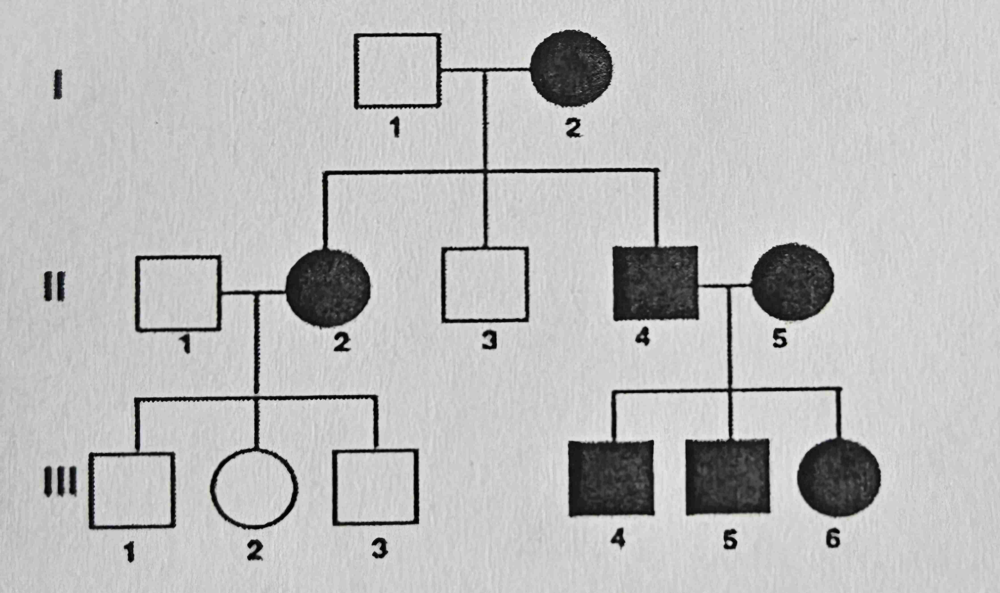
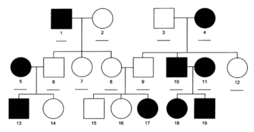
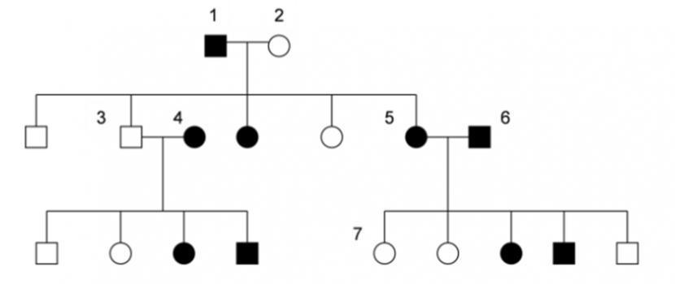

# Module 10 Genetic Inheritance Test v1

## Short Answer

1. At a flower farm, the farmer decides to cross red dahlias with yellow dahlias to produce dahlias with mixed stripes of red and yellow for an upcoming dahlia competition. The offspring (F1 generation) all showed red-yellow stripes. Not knowing genetics, the farmer decides to cross the F1 flowers with the original red dahlias, hoping to get more red stripes in the red-yellow striped flowers. Would the farmer succeed in getting more red stripes in the red-yellow striped flowers? Why or why not? What is the phenotypic ratio of the F2 offspring? Show your work. (3 points)

    Let's denote the alleles for red and yellow color as \( R \) and \( Y \), respectively. The genotype of the original red dahlias is \( RR \), and the genotype of the original yellow dahlias is \( YY \). The F1 generation (red-yellow striped dahlias) have the genotype \( RY \).

    When the farmer crosses the F1 \( RY \) flowers with the original red \( RR \) flowers, we can use a Punnett square to predict the outcomes:

    |   | R  | R  |
    |---|----|----|
    | R | RR | RR |
    | Y | RY | RY |

    The possible genotypes of the offspring from this cross are:

    - 50% \( RR \) (solid red)
    - 50% \( RY \) (red-yellow striped)

    Phenotypically, this cross would result in:

    - 50% solid red dahlias
    - 50% red-yellow striped dahlias

    The farmer's objective was to get more red stripes in the red-yellow striped flowers. However, by crossing the F1 generation \( RY \) with the red \( RR \) flowers, the farmer does not increase the proportion of red stripes in the striped flowers. Instead, the farmer produces half solid red flowers and half red-yellow striped flowers. The number of red stripes in the striped flowers remains unchanged.

    The phenotypic ratio of the F2 offspring from this specific cross is:

    - 1 solid red : 1 red-yellow striped

    So, the phenotypic ratio is \( 1:1 \).

    Work and Explanation:

    1. Initial Cross: \( RR \) (red) x \( YY \) (yellow)
        - All F1 offspring are \( RY \) (red-yellow striped).

    2. Cross F1 with Red Dahlias: \( RY \) (red-yellow striped) x \( RR \) (red)
        - Punnett square analysis:
            - 50% \( RR \) (solid red)
            - 50% \( RY \) (red-yellow striped)

    3. Phenotypic Outcome:
        - 50% solid red
        - 50% red-yellow striped

    Therefore, the farmer would not succeed in getting more red stripes in the red-yellow striped flowers, and the phenotypic ratio of the F2 offspring is \( 1:1 \) (solid red: red-yellow striped).

2. In grapefruit trees, white fruit color is dominant over red. A breeder wants to know if his white grapefruit tree is homozygous or heterozygous. What should he do? How would he know? (2 points)

    To determine if the white grapefruit tree is homozygous (WW) or heterozygous (Ww) for the white fruit color trait, the breeder should perform a test cross. A test cross involves crossing the white grapefruit tree with a tree that is homozygous recessive for the trait, which in this case would be a tree with red fruit (ww).

    Here's how the breeder should proceed:

    1. Cross the White Grapefruit Tree with a Red Grapefruit Tree:
        - The genotype of the white grapefruit tree is either WW (homozygous) or Ww (heterozygous).
        - The genotype of the red grapefruit tree is ww (homozygous recessive).

    2. Possible Outcomes of the Test Cross:
        - If the white grapefruit tree is homozygous (WW):
            - The cross would be WW x ww.
            - All offspring (F1) will have the genotype Ww, resulting in white fruit.
            - Phenotypically, 100% of the offspring will have white fruit.

        - If the white grapefruit tree is heterozygous (Ww):
            - The cross would be Ww x ww.
            - The offspring (F1) will have the following genotypes:
                - 50% Ww (white fruit)
                - 50% ww (red fruit)
            - Phenotypically, 50% of the offspring will have white fruit and 50% will have red fruit.

    3. Interpret the Results:
        - If all the offspring have white fruit, the breeder can conclude that the white grapefruit tree is homozygous (WW).
        - If there is a mix of white and red fruit in the offspring, the breeder can conclude that the white grapefruit tree is heterozygous (Ww).

    By analyzing the fruit color of the offspring from this test cross, the breeder will be able to determine the genotype of the white grapefruit tree.

3. Danny has type B blood. He is very sure that his father has type O blood. Danny is married to Veronica who has type A blood. Veronica has a brother with type O blood and a father with type B blood. What are the phenotypic ratios of the blood types of their children? Show your work. (2 points)

    To determine the phenotypic ratios of the blood types of Danny and Veronica's children, we need to first determine the possible genotypes of Danny and Veronica based on their own blood types and their family histories.

    Danny's Genotype

    - Danny has type B blood. His genotype can be either \( B \) (BB or BO).
    - Danny's father has type O blood (genotype \( OO \)).
    - Since Danny's father can only pass on the \( O \) allele, Danny's genotype must be \( BO \).

    Veronica's Genotype:

    - Veronica has type A blood. Her genotype can be either \( A \) (AA or AO).
    - Veronica's brother has type O blood (genotype \( OO \)).
    - Since Veronica's parents must each carry an \( O \) allele to have a child with type O blood, her father with type B blood must be \( BO \) and her mother must be \( AO \) or \( OO \).
    - Given that Veronica's father is \( BO \) and her brother is \( OO \), her mother's genotype must be \( AO \).
    - Therefore, Veronica's genotype is \( AO \).

    Possible Genotypes of the Children:

    To find the phenotypic ratios of the children's blood types, we set up a Punnett square for the cross between Danny (\( BO \)) and Veronica (\( AO \)).

    |       | B   | O   |
    |-------|-----|-----|
    | A     | AB  | AO  |
    | O     | BO  | OO  |

    Phenotypic Outcomes and Ratios:

    From the Punnett square, the possible genotypes and corresponding blood types are:

    1. AB (AB blood type)
    2. AO (A blood type)
    3. BO (B blood type)
    4. OO (O blood type)

    Each genotype has an equal probability (1 out of 4) of occurring.

    Phenotypic Ratios:

    - AB blood type: 1 out of 4 (25%)
    - A blood type: 1 out of 4 (25%)
    - B blood type: 1 out of 4 (25%)
    - O blood type: 1 out of 4 (25%)

4. In Golden Retriever (a specific breed of dog), one gene determines their fur color and another for fur type. The C gene on an autosomal chromosome which controls fur color is incomplete dominance where the homozygous phenotypes are black and yellow, and the hybrid phenotype is bronze. The F gene on X chromosome which controls fur type is sex-linked (in dogs, sex chromosomes giving rise to male and female are the same as humans). For fur type, coarse fur is dominant to smooth fur. Randy decides to breed his smooth, bronze fur male dog with his heterozygous coarse, yellow female dog. What is the phenotypic ratio of the cross (do not separate males and females in the ratio)? Show your work. (4 points)

    To determine the phenotypic ratio of the offspring from Randy's cross, we need to consider the inheritance patterns of both fur color and fur type. Here are the steps to solve this problem:

    Genotypes

    Fur Color (C gene):

    - The fur color gene \(C\) exhibits incomplete dominance.
        - Homozygous \(CC\) results in black fur.
        - Homozygous \(cc\) results in yellow fur.
        - Heterozygous \(Cc\) results in bronze fur.

    - The male dog has bronze fur, so his genotype is \(Cc\).
    - The female dog has yellow fur and is heterozygous, so her genotype is \(cc\).

    Fur Type (F gene, X-linked):

    - Coarse fur is dominant (F) and smooth fur is recessive (f).
    - The male dog has smooth fur. Since males are XY, his genotype for fur type is \(X^fY\).
    - The female dog is heterozygous for coarse fur. Since females are XX, her genotype for fur type is \(X^F X^f\).

    Possible Gametes

    Male Dog (Cc, \(X^f Y\)):
    - Fur color: \(C\) or \(c\)
    - Fur type: \(X^f\) or \(Y\)

    Female Dog (cc, \(X^F X^f\)):
    - Fur color: \(c\)
    - Fur type: \(X^F\) or \(X^f\)

    Punnett Square for Fur Color

    | Male \ Female | \(c\)           |
    |---------------|-----------------|
    | \(C\)         | \(Cc\) (bronze) |
    | \(c\)         | \(cc\) (yellow) |

    Punnett Square for Fur Type

    Since the fur type gene is X-linked, we need to consider the combinations separately for male and female offspring. We'll combine the results for a single Punnett square showing both males and females.

    | Male \ Female | \(X^F\)              | \(X^f\)              |
    |---------------|----------------------|----------------------|
    | \(X^f\)       | \(X^F X^f\) (coarse) | \(X^f X^f\) (smooth) |
    | \(Y\)         | \(X^F Y\) (coarse)   | \(X^f Y\) (smooth)   |

    Fur Color:

    - \(Cc\) (bronze)
    - \(cc\) (yellow)

    Fur Type:

    - \(X^F X^f\) (coarse, female)
    - \(X^f X^f\) (smooth, female)
    - \(X^F Y\) (coarse, male)
    - \(X^f Y\) (smooth, male)

    Phenotypic Ratios

    Combining the two traits (fur color and fur type):

    1. Bronze, Coarse fur:
        - Genotype: \(Cc\) and \(X^F X^f\) or \(X^F Y\)
        - Probability: \(1/2 \times 1/2 = 1/4\)

    2. Bronze, Smooth fur:
        - Genotype: \(Cc\) and \(X^f X^f\) or \(X^f Y\)
        - Probability: \(1/2 \times 1/2 = 1/4\)

    3. Yellow, Coarse fur:
        - Genotype: \(cc\) and \(X^F X^f\) or \(X^F Y\)
        - Probability: \(1/2 \times 1/2 = 1/4\)

    4. Yellow, Smooth fur:
        - Genotype: \(cc\) and \(X^f X^f\) or \(X^f Y\)
        - Probability: \(1/2 \times 1/2 = 1/4\)

    Final Phenotypic Ratio:

    The phenotypic ratio of the offspring will be:
    - 1/4 Bronze, Coarse fur
    - 1/4 Bronze, Smooth fur
    - 1/4 Yellow, Coarse fur
    - 1/4 Yellow, Smooth fur

    This gives us a final ratio of:

    1 Bronze, Coarse fur : 1 Bronze, Smooth fur : 1 Yellow, Coarse fur : 1 Yellow, Smooth fur

5. In mice, the agouti gene controls the distribution of black pigment. A mutation of the gene causes the mice to have a yellow coat color instead of an agouti (black) coat. Research has shown that mice with one mutated allele had yellow coat, while those who inherited both mutated alleles could not survive at birth. An agouti male mouse is crossed with a yellow female mouse.

    1. What are the chances that their live offspring will display yellow coat? Show you work. (1 point)

        To determine the chances that the live offspring of an agouti male mouse and a yellow female mouse will display a yellow coat, we need to understand the inheritance pattern of the agouti gene and the mutation that causes the yellow coat.

        Let's denote:
        - \( A \) as the normal agouti allele (black coat).
        - \( a^y \) as the mutant allele causing the yellow coat.

        From the problem, we know the following:
        - Mice with genotype \( AA \) or \( Aa^y \) have an agouti (black) coat.
        - Mice with genotype \( a^y a^y \) do not survive at birth.
        - Mice with genotype \( Aa^y \) have a yellow coat.

        The agouti male mouse has a genotype of \( AA \) (since it has an agouti coat and no indication of a yellow phenotype).

        The yellow female mouse has a genotype of \( Aa^y \) (since she displays the yellow phenotype and is alive, meaning she has only one \( a^y \) allele).

        To find the probabilities of their offspring's genotypes, we set up a Punnett square:

        \[
        \begin{array}{c|cc}
        & A & A \\
        \hline
        A^y & AA^y & AA^y \\
        A   & AA   & AA \\
        \end{array}
        \]

        From the Punnett square, we see that the possible genotypes of the offspring are:
        - \( AA \) (50% probability)
        - \( Aa^y \) (50% probability)

        Now we consider the phenotypes:
        - \( AA \) results in an agouti (black) coat.
        - \( Aa^y \) results in a yellow coat.

        Therefore, the chances of their live offspring displaying a yellow coat are:
        - 50% (for \( Aa^y \))

        So, the probability that their live offspring will display a yellow coat is 50%.

    2. If the yellow female mouse was crossed with another yellow male mouse instead, what would be the phenotypic ratios of their live offspring? Show your work. (2 points)

        To determine the phenotypic ratios of the live offspring when a yellow female mouse is crossed with a yellow male mouse, we need to consider their genotypes.

        As established:
        - Yellow mice have the genotype \( A^y A \).
        - These yellow mice can survive because they have one normal allele and one mutant allele.

        Let's denote:
        - \( A \) as the normal agouti allele (black coat).
        - \( A^y \) as the mutant allele causing the yellow coat.

        Both the yellow female mouse and the yellow male mouse have the genotype \( A^y A \).

        We set up a Punnett square to determine the genotypic combinations of their offspring:

        \[
        \begin{array}{c|cc}
        & A^y & A \\
        \hline
        A^y & A^yA^y & A^yA \\
        A   & A^yA & AA \\
        \end{array}
        \]

        From the Punnett square, the possible genotypes of the offspring are:
        - \( A^y A^y \) (25% probability, but these do not survive)
        - \( A^y A \) (50% probability)
        - \( AA \) (25% probability)

        Since the \( A^y A^y \) genotype does not result in live offspring, we exclude them from the phenotypic ratio calculation. The remaining genotypes are \( A^y A \) and \( AA \).

        Phenotypes based on genotypes:
        - \( A^y A \) results in a yellow coat.
        - \( AA \) results in an agouti (black) coat.

        Now, considering only the live offspring:
        - The \( A^y A \) genotype occurs with a 2 out of 3 probability.
        - The \( AA \) genotype occurs with a 1 out of 3 probability.

        So, the phenotypic ratio of the live offspring is:
        - Yellow coat ( \( A^y A \) ): 2/3
        - Agouti coat ( \( AA \) ): 1/3

        Therefore, the phenotypic ratio of their live offspring is 2 yellow : 1 agouti.

## Multiple Choice

1. When a plant breeder crossed two red roses, 78% of the offspring had red flowers and 22% had white flowers. According to these results, the allele for red flowers is most likely:

    1. **dominant**
    2. recessive
    3. sex-linked
    4. codominant
    5. homozygous

2. The pedigree below tracks the presence of attached earlobes through a family's generation. Having attached earlobes is an autosomal recessive trait.

    

    If individuals 1-1 and 1-2 had a fourth child, what is the chance that the child would not have attached earlobes?

    1. 0%
    2. 25%
    3. **50%**
    4. 75%
    5. 100%

3. In rabbits, there are four different versions of a gene for fur color. What pattern of inheritance is this?

    1. **Multiple alleles**
    2. Incomplete dominance
    3. Codominance
    4. Polygenic inheritance
    5. Sex-linked

4. Hemophilia is a sex-linked blood disorder, where an affected person's blood does not clot. A female carrier for hemophilia has a child with an unaffected mal5. If their child is a daughter, what are the chances of the daughter having hemophilia?

    1. **0%**
    2. 25%
    3. 50%
    4. 75%
    5. 100%

5. A farmer bought peas to plant in his new fiel4. He was assured that the peas were pure yellow pea plants. Yellow is dominant over green. Which of the following would he do to determine if the seller was honest?

    1. Self-pollinate the pea plants.
    2. Cross them with yellow pea plants.
    3. Cross them with a mix of yellow and green pea plants.
    4. **Cross them with green pea plants.**
    5. There is no way to confirm.

6. The different forms of a gene are called:

    1. crossing over
    2. phenotypes
    3. **alleles**
    4. hybrids
    5. variations

7. Roan cattle inherit their hair color through codominanc5. There are alleles for dark red hair and white hair. What would the heterozygous cattle look like?

    1. Dark red
    2. Pink
    3. **Spotted**
    4. White
    5. Grey

8. Which of the laws developed from the concept that the offspring will inherit one allele from each parent for each trait?

    1. The law of genotype
    2. **The law of segregation**
    3. The law of independent assortment
    4. The law of Mendelian inheritance
    5. None of the above

9. If a hybrid purple flower plant is self-pollinated, what is the percent chance of offspring that would produce phenotypically purple flower plants? Purple color is a dominant allele in this flower species. P

    1. 0%
    2. 25%
    3. 50%
    4. **75%**
    5. 100%

10. The pedigree below tracks Duchenne Muscular Dystrophy (DMD) through several generations. DMD is a X-linked recessive trait.

    

    If individual II-3 has a son with a carrier woman, what is the percent chance that he will have DMD?

    1. 0%
    2. 25%
    3. **50%**
    4. 75%
    5. 100%

## Matching

For the following two questions, match the pedigrees with the correct type of inheritance. *You may use the following choices once, more than once, or none at all.*

- Dominant
- Recessive

1. 

    Recessive

2.  

    Dominant

## Extra Credit

1. Which of the following is a dominant genetic disorder?

    1. Cystic Fibrosis
    2. Albinism
    3. Galactosemia
    4. **Huntington's disease**
    5. Sickle cell anemia