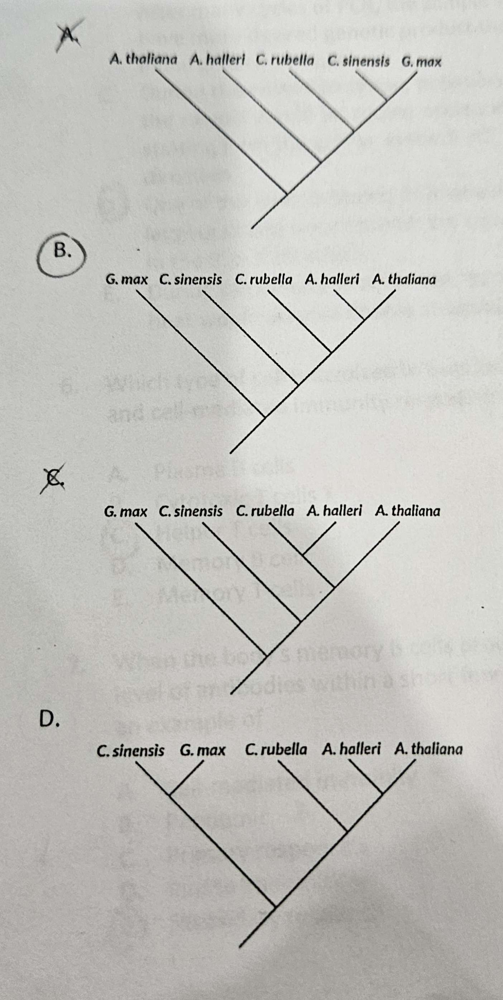

# Module 16, 17, 27, 12 Phylogeny, Bacteria, Virus, Immune System, Bioteachnology Test v1

## Multiple Choice

1. Innate immunity includes (Select all correct choices).

    1. Antibodies
    2. **Inflammation**
    3. Cytotoxic T cells
    4. **Acidic environment**
    5. Vaccines

2. When using a P100 micropipette, you should NOT: (Select all correct choices)

    1. use a micropipette tip when obtaining a sample.
    2. **press to the second stop point when trying to obtain a viscous sample.**
    3. slowly let go of the plunger when obtaining a sample.
    4. **lay down the micropipette with liquid when you need to open a container.**
    5. use it to obtain 27uL of a sample.

3. Which of the following is/are false about viruses. (Select all correct choices)

    1. **Have plasmids**
    2. Require a host to reproduce✓
    3. Cause systemic infection
    4. **Are treated with antibiotics**
    5. **Are enclosed by cell wall**

4. An individual was infected by the original strain of COVID 19. The same individual was recently exposed to the Omicron variant of COVID-10. Will the same B cell be able to fight the Omicron variant where the antigen is now slightly different due to mutation?

    1. Yes. B cell can fight every pathogen with which it encounters.
    2. **No. B cells can only produce antibodies targeting the original antigen.**
    3. Yes. B cell recognizes all types of viruses.
    4. No. B cells causes apoptosis to only specific antigens.
    5. Yes. B cells can mutate and detect new mutations.

5. Which of the following statements about the Polymerase Chain Reaction (PCR) are false? Select all that apply.

    1. **During the annealing phase, primers would form H-bonds with any random DNA sequences.**
    2. After many cycles of PCR, the sample would have more desired genetic product than the initial genetic sample.
    3. During the extension phase, polymerase in the sample would be adding nucleotides starting from the primer in the 5'->3' direction.
    4. **One of the strands during PCR would be the lagging strand since polymerase can only add in the 5'-> 3' direction.**
    5. During the denaturation phase, the high heat would unwind double stranded DNA.

6. Which type of cell is involved in both humoral and cell-mediated immunity responses?

    1. Plasma B cells
    2. Cytotoxic T cells
    3. **Helper T cells**
    4. Memory B cells
    5. Memory T cells

7. When the body's memory B cells produce a high level of antibodies within a short few days, this is an example of

    1. Cell-mediated immunity
    2. Pandemic
    3. Primary response
    4. Innate immunity
    5. **Secondary response**

8. When loading and running a gef electrophoresis, you should (Select all correct choices)

    1. make sure to insert the micropipette tip into the well touching the bottom of the well while loading the sample
    2. **always turn off and unplug the electric cable opening the gel electrophoresis chamber.**
    3. place the agarose gel with the well closest to the positive end of the gef electrophoresis chamber.
    4. **gently handle the agarose gel and load the samples by having the micropipette tip just on top of the well.**
    5. allow the gel electrophoresis to run overnight as there is no concern about running too long as it will give you better separation.

9. Consider the information below about restriction enzymes and their target sequences.

    | Enzyme  | Target sequence            |
    |---------|----------------------------|
    | EcoRI   | 5 GAATTC 3 3 CITAAG 5  |
    | EcoRV   | 5 GATATC 3 3 CTATAG 5' |
    | HaeIII  | 5 GGCC 3 3 CCGG 5      |
    | HindIII | 5 AAGCTT 3 3 TTCGAA 5  |

    Which restriction enzymes would be able to cleave (cut) the following DNA sequence?

    5'-CGAATTGGCAAGCTGATATTAAGCTGGC-3'

    1. EcoRI
    2. EcoRV
    3. HaeIII
    4. HindIII
    5. None of the enzymes

10. Which of the following statements about viruses are true? Select all that apply.

    1. Viruses are considered prokaryotes because their genetic material is not enclosed in a nucleus.
    2. **Viruses' genetic material can be RNA or DNA.**
    3. **Some viral diseases are vector borne such that flies and fleas can transmit the virus to humans.**
    4. **Viruses can insert their genetic material into the host cell's genome.**
    5. **COVID is an example of a zoonotic disease as it can be transmitted from dogs to humans.**

11. When comparing bacteria and viruses, which of the following is false?

    1. **Bacterial infections are generally systemic in nature, while viral infections are localized.**
    2. Bacteria have a few organelles, but viruses have none.
    3. Bacteria has some form of cell wall as its outer layer, while viruses have a protein coat or capsule.
    4. Viruses are generally smaller in size compared to bacteria.
    5. Viral infections cannot be treated with antibiotics which is a treatment specifically for bacterial infections.

12. Which of the following correctly describes and matches bacteria with their characteristic?

    1. Bacteria are unicellular and are eukaryotes.
    2. Bacteria infect humans by inserting genetic information into host cells to replicate.
    3. **Bacteria reproduces through binary fission, which is a form of asexual reproduction.**
    4. Bacteria are enclosed by a protein coat that manages what goes in and out of the cell.
    5. Bacteria has double-stranded DNA in the form of chromosomes.

    For the next three questions, correctly match the following descriptions to the type of acquired immunity:

    - Active immunity
    - Passive immunity

13. Infant receiving antibodies through mother's milk or fetus through the placenta. **Passive Immunity**
14. Injected with a weakened virus. **Active Immunity**
15. Harvesting antibodies from a horse to use as antivenom treatment for venomous spider bites. **Passive Immunity**

    For the next two questions, correctly match the following descriptions to the type of vaccine:

    - mRNA vaccines
    - Vector-based vaccines
    - Attenuated vaccines
    - Dead virus vaccines

16. Using a harmless adenovirus to deliver the DNA instructions of making the viral antigen into the nucleus of the body cells. **Vector-based vaccines**
17. The more traditional way of making vaccine which requires many generations of viruses growing in chicken embryo cells. **Attenuated vaccines**
18. The following cladogram shows the evolutionary relationships among several groups of vertebrates, Selected derived characters are labeled on the cladogram.

    Based on the cladogram, which of the following derived characters is shared by orangutans and eagles but is not present in salamanders?

    1. Bony skeleton
    2. **Amniotic egg**
    3. Two post-orbital fenestrae
    4. Hair
    5. Four limbs

19. The following table shows selected derived characters for a set of animal species.

    Based on the information in the table, which of the following cladograms best represents the evolutionary relationships among the species?

    

20. Many plants sense and respond to light with the help of the phytochrome A protein. The phytochrome A protein is encoded by the Phy gene.

    Scientists compared the nucleotide sequences of the PhyA gene from five different plant species. To do this, the scientists calculated the percentage of nucleotides in the PhyA gene that were shared by each pair of species. The results are shown in the table below.

    |             | C. sinensis | A. thaliana | G. max | C. rubella | A. halleri |
    |-------------|-------------|-------------|--------|------------|------------|
    | C. sinesis  | 100%        | 76.5%       | 71.9%  | 76.5%      | 76.5%      |
    | A. thaliana |             | 100%        | 68.6%  | 94.8%      | 97.3%      |
    | G. max      |             |             | 100%   | 68.2%      | 68.8%      |
    | C. rubella  |             |             |        | 100%       | 95%        |
    | A. halleri  |             |             |        |            | 100%       |

    Table 1. Percentage of identical nucleotides in PhyA coding sequences for five species:

    