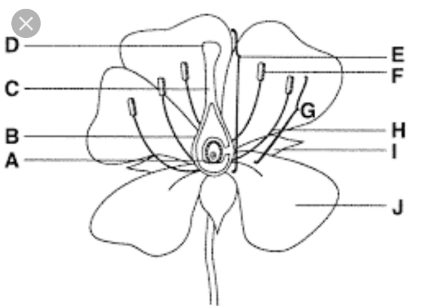

# Module 19, 24 Quiz v1

1. Which of the following examples is a negative tropism response?

    1. When a potted plant falls over, the shoot systern will orient itself to continue growing in the direction towards the light source.
    2. When seeds are planted, they will naturally begin to grow their roots downwards.
    3. Passion fruit vines often need a support structure where the vines would grasp onto any surface to prop themselves up.
    4. **Plants planted by a large source of fertilizer will be found with roots growing away from it due to potential water loss to fertilizer.**
    5. A Venus fly trap closes when a fly lands on it.

2. Which of the following is not part of the nephron?

    1. Loop of Henle
    2. Convoluted tubules
    3. **Renal artery**
    4. Glomerulus
    5. Bowman's capsule

3. Systolic pressure is the pressure on the arteries when the heart, and the diastolic pressure is the pressure on the arteries when the heart _.

    1. contracts; contracts
    2. relaxes; contracts
    3. **contracts; relaxes**
    4. relaxes; relaxes

4. Which of these is an incorrect statement concerning the heartbeat?

    1. The left and right ventricles contract and relax at the same time.
    2. Blood flows from the heart to the pulmonary and the systemic circulation at the same time.
    3. The atria contract at the same time.
    4. **The right side of the heart contracts first and then the left side contracts.**
    5. The atrioventricular valves open at the same time.

5. Flowering plants reproduce utilizing a double fertilization mechanism where they produce a and a that becomes a source of nutrient during germination.

    1. Monoploid embryo; diploid endosperm
    2. Diploid embryo; diploid endosperm
    3. **Diploid embryo, triploid endosperm**
    4. Triploid embryo; diploid endosperm
    5. Triploid embryo; triploid endosperm

6. When the kidneys detect an increase in salt (more than what the body needs) they respond by: [Select all correct choices]

    1. excreting less salt in urine.
    2. **returning less salt to the blood by reabsorption.**
    3. filtering less salt from the glomerulus into the Bowman's capsule.
    4. returning more salt to the blood by reabsorption.
    5. **returning less salt from the convoluted to the capillaries.**

7. In the diagram below, structure E refers to, and male gametes are produced and found on structure _.

    

    1. Stigma; D
    2. Style; H
    3. **Pistil; F**
    4. Stamen; I
    5. Sepal; C

8. Monocotyledons characteristics include the following: [Select all correct choices]

    1. Netlike leaf veins
    2. Taproot
    3. **Scattered vascular bundles**
    4. **Flower petals in multiple of three**
    5. Two cotyledons

9. Which of the following correctly orders the flow of blood/urine from the heart to the liquid waste being expelled?

    1. Renal artery → Bowman's capsule → Convoluted tubules → Bladder → Ureter
    2. Glomerulus → Bowman's capsule → Collecting ducts → Urethra → Bladder
    3. Aorta → Bowman's capsule → Collecting ducts → Glomerulus → Bladder
    4. **Renal artery → Bowman's capsule → Loop of Henle → Bladder → Urethra**
    5. Aorta → Bowman's capsule → Loop of Henle → Ureter → Convoluted tubules

10. Which of the following correctly orders the flow of blood in the heart and blood vessels in the pulmonary circulation?

    1. Right ventricle → bicuspid valve → pulmonary vein → left atrium → aorta
    2. Left atrium → mitral valve → right ventricle → pulmonary artery → semilunar valve → pulmonary vein
    3. Right atrium → tricuspid valve → right ventricle → pulmonary artery → semilunar valve
    4. **Vena cava → right atrium → right ventricle → semilunar valve → pulmonary artery**
    5. Aorta → atrium → vena cava → pulmonary artery → left atrium → semilunar valve

11. The differences between arteries and veins are that: [Select all correct choices)

    1. blood flows at higher pressure in veins.
    2. arteries have one-way valves.
    3. **arteries carry blood away from the heart.**
    4. **veins have a larger lumen.**
    5. **most veins carry deoxygenated blood and most arteries carry oxygenated blood.**

12. Which of the following are the TWO major causes of kidney disease? (Select 2 correct choices]

    1. High protein diet
    2. Regular consumption of fiber
    3. **Diabetes**
    4. Use of antibiotics
    5. **High blood pressure**

13. Kidneys produce urine as a waste product. Which two substances should NOT be present in urine normally?

    1. Salt
    2. Urea
    3. **Lymphocytes**
    4. Water
    5. **Glucose**

14. The human heart is known as a double pump because

    1. It beats twice to contract the right atrium and then the left atrium.
    2. The nodes send two signals causing the relaxation of the ventricles and then the atrias.
    3. Blood flows through the heart twice through a single heartbeat.
    4. The beating of the heart causes the sound known as "lub-dub".
    5. **The heart pumps blood to the pulmonary and systemic circulation simultaneously.**

15. The nervous system and circulatory system are linked in that:

    1. the sinoatrial node sends signals to the ventricles to contract
    2. the atrioventricular node sends signals to the atria to contract
    3. the sinoatrial and atrioventricular nodes are collectively known as the pacemaker to set the rhythm of the heartbeat
    4. **the sinoatrial node sends signals to the atria to contract**
    5. the atrioventricular node sends signals to the ventricles to relax

16. In the evolution of plants from water dwelling organisms to terrestrial (land) dwelling organisms, plants needed adaptation of: [Select 2 correct choices]

    1. roots to anchor itself to the ground.
    2. **vascular structures for upright support.**
    3. chloroplast to be able to engage in photosynthesis.
    4. **waxy cuticle layer to prevent water loss.**
    5. leaves to capture sunlight for photosynthesis.

17. [1 pt] Explain why the heart makes a lub-dub sound each time it beats (be specific):

    The "lub-dub" sound of the heart is produced by the closing of the heart valves during the cardiac cycle.

    - "Lub" (S1): This first sound occurs when the atrioventricular (AV) valves (the tricuspid and mitral valves) close at the beginning of ventricular systole. This prevents the backflow of blood from the ventricles into the atria.
    - "Dub" (S2): This second sound occurs when the semilunar valves (the aortic and pulmonary valves) close at the end of ventricular systole, marking the beginning of ventricular diastole. This prevents the backflow of blood from the arteries into the ventricles.

18. [1 pt] Name both devices that were used to measure blood pressure in class:

    - Sphygmomanometer: This is the traditional device used to measure blood pressure, consisting of an inflatable cuff to restrict blood flow and a mercury or aneroid manometer to measure the pressure.
    - Automated blood pressure monitor: This is an electronic device that automatically measures blood pressure using an oscillometric method, providing digital readings.