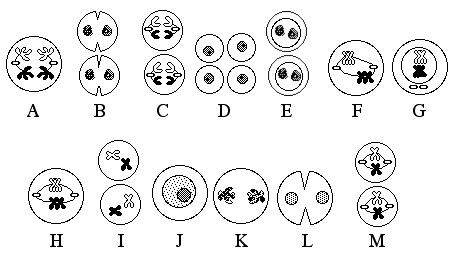
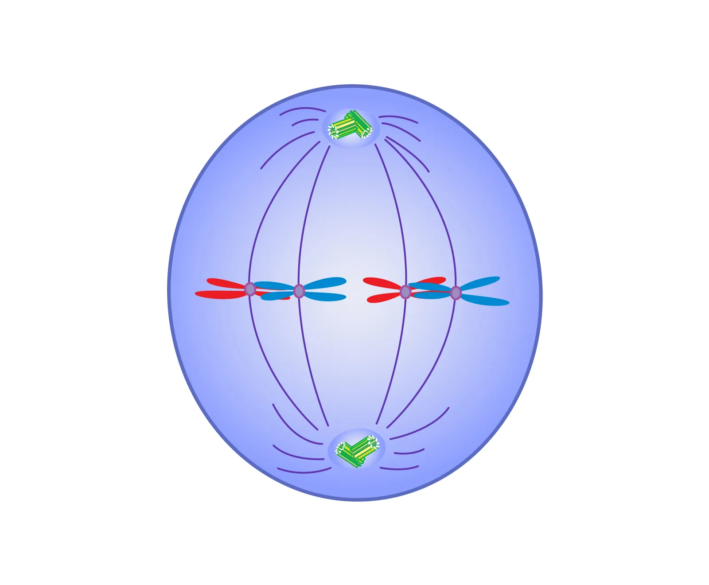
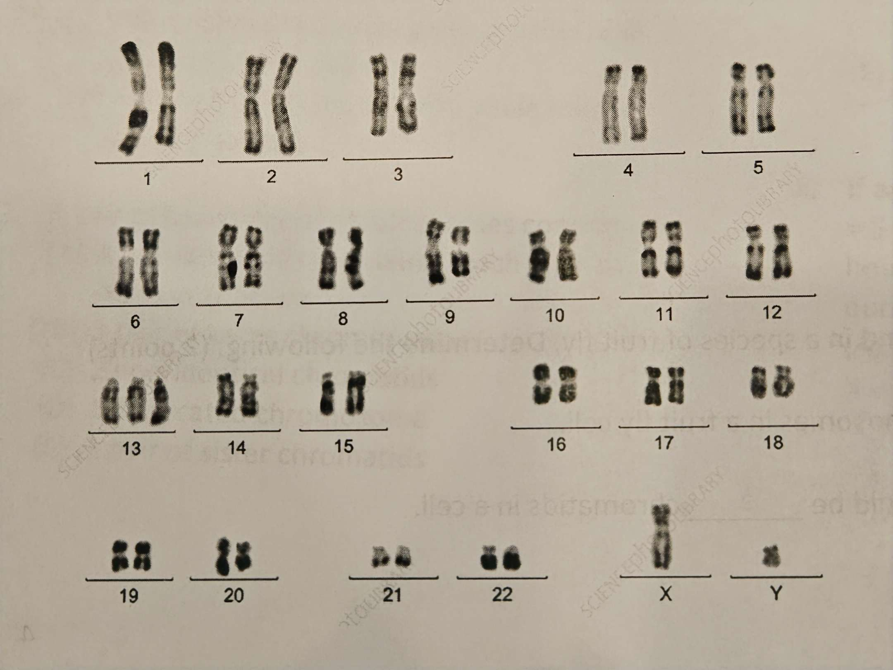

# Module 9 Test v1

## Multiple Choice

1. Meiosis II differs from Mitosis in that

    1. homologous chromosomes separate in meiosis II, but sister chromatids separate in mitosis.
    2. **meiosis II produces haploid daughter cells, while mitosis produces diploid daughter cells.**
    3. sister chromatids line up during metaphase II, but homologous chromosomes line up in metaphase in mitosis
    4. DNA replication occurs prior to meiosis II but not prior to mitosis.
    5. meiosis II produces 2n cells, while mitosis produces n cells.

2. A pair of homologous chromosomes consists of

    1. 4 non-identical chromatids, each with its own centromere
    2. **1 pair of sister chromosomes**
    3. 2 non-identical chromatids
    4. 1 duplicated chromosome
    5. 1 pair of sister chromatids

3. Koalas have a total of 8 pairs of chromosomes. At the end of meiosis, koalas would produce gametes with a total of

    1. 2 chromosomes
    2. 4 chromosomes
    3. **8 chromosomes**
    4. 16 chromosomes
    5. 32 chromosomes

4. Which of the following is the correct arrangement of genetic material from largest to smallest in size?

    1. Chromatin, nucleotides, double helix DNA, sister chromatids, non-duplicated chromosome.
    2. **Sister chromatids, non-duplicated chromosome, chromatin, double helix DNA, nucleotides.**
    3. Nucleotides, double helix DNA, chromatin, non-duplicated chromosome, sister chromatids.
    4. Double helix DNA, nucleotides, chromatin, sister chromatids, non-duplicated chromosome.
    5. Nucleotides, chromatin, double helix DNA, sister chromatids, non-duplicated chromosome.

5. Which of the following statements is true regarding the number of chromosomes in humans?

    1. Humans have 22 autosomes and 2 sex chromosomes.
    2. Humans have 23 pairs of autosomes.
    3. The number of chromosomes is generally unique to everyone.
    4. Humans have 22 pairs of autosomes and 2 pairs of sex chromosomes.
    5. **Humans have 44 autosomes and 1 pair of sex chromosomes.**

6. If an organism has the chromosome number 2n = 5 (in other words, 5 pairs of chromosomes), how many ways can the chromosomes line up during metaphase I?

    1. 5
    2. 10
    3. 16
    4. 25
    5. **32**

7. During cellular reproduction, if a cell does not meet the requirements at a checkpoint of the cell cycle, what would happen to the cell given that all the checkpoints are functional?

    1. Nondisjunction
    2. **Apoptosis**
    3. Cytokinesis
    4. Independent assortment
    5. Crossing over

8. Which of the following are risk factors are known to cause cancer? Select all the apply.

    1. **Exposure to UV radiation (sunlight)**
    2. **Exposure to cigarette smoke**
    3. **Exposure to X-rays**
    4. Exposure to plants and herbs
    5. **Genetics/Family history**

    For Questions 9-12, refer to the image and answer choices below.

    

    - Prophase I
    - Metaphase I
    - Anaphase I
    - Telophase I
    - Cytokinesis
    - Prophase II
    - Metaphase II
    - Anaphase II
    - Telophase II

9. Identify the meiosis phase labeled C. **Anaphase II**
10. Identify the meiosis phase labeled K. **Telophase I**
11. Identify the meiosis phase labeled M. **Metaphase II**
12. Identify the meiosis phase labeled I. **Prophase II**

    For Questions 13-15, use the following answer choices:

    - Prophase
    - Metaphase
    - Anaphase
    - Telophase
    - Cytokinesis
    - Checkpoint
    - G1 phase
    - G2 phase
    - S phase

13. During which phase does nuclear membrane begin to form? **Telophase**
14. During which phase are chromosomes duplicated? **S phase**
15. During which phase does the cytoplasm of the cell completely separate? **Cytokinesis**
16. Select the phase the diagram below depict.

    

    **Metaphase**

17. In order to ensure efficient diffusion of materials into and out of the cell, cells must have:

    1. **high surface area to volume ratio**
    2. low surface area to volume ratio
    3. high numbers of centrioles
    4. low numbers of microtubules
    5. high IQ

18. How does crossing over in prophase I contribute to genetic diversity?

    1. Some genes are exchanged between sister chromatids of a duplicated chromosome.
    2. **Some genes are exchanged between non-sister chromatids of homologous chromosomes.**
    3. Some genes move from one pair of chromosomes to another pair of chromosome.
    4. More genes are added to the chromosomes and exchanged between sister chromatids.
    5. All the genes in homologous chromosomes are swapped.

19. Aneuploidy screening identifies couples at risk of having a baby with a genetic syndrome while carrier screening shows the likelihood of the baby having an abnormal number of chromosomes.

    1. True
    2. **False**

20. Fertilization creates genetic diversity by allowing each parent to randomly contribute a unique set of genes to a newly fertilized cell.

    1. **True**
    2. False

21. Most of our body cells spend the most amount of time in interphase of the cell cycle.

    1. **True**
    2. False

22. A nucleosome is DNA wrapped around histone proteins.

    1. **True**
    2. False

23. Chromatin fibers condense/supercoil to become chromosomes during G1 phase of the cell cycle.

    1. True
    2. **False**

24. Individuals with Down syndrome can live to adulthood and make significant contributions to their companies and communities.

    1. **True**
    2. False

25. BONUS: If two individuals who have Down Syndrome (Trisomy 21) decide to have children, what is most certain to happen?

    1. As individuals with 47 chromosomes each, they will have children with 48 chromosomes.
    2. Most of their children will have Down Syndrome, as it is a disease.
    3. **They have low reproduction rates due to chromosomes unable to pair correctly in Metaphase I.**
    4. Down Syndrome individuals will die before they can reproduce.
    5. They will not be able to produce normal diploid (2n) children.

## Short Answer

### Part A

The karyotype of a fetus is shown below:

1. Identify the genetic diagnosis AND the gender of the fetus. (1 point)
2. Looking at the specific chromosome causing the genetic diagnosis above, the medical professional identified th all 3 of the chromatids are not identical. Determine which type of nondisjunction occurred and explain your answer. (2 points)

### Part B

1. Identify ONE similarity of ONE difference between Anaphase of mitosis and Anaphase I of meiosis. Ensure the use of proper vocabulary. (1 point)
2. Name the process in Meiosis that results in gametes that are uniquely different due to each pair of chromosome aligning randomly before separating. Briefly describe the process identified. (2 points)
3. The picture above shows the chromosomes found in a species of fruit fly. Determine the following: (2 points)
    1. In Prophase, there would be 3 chromosomes in a fruit fly cell.
    2. In the beginning of Anaphase II, there would be 3 chromatids in a cell.