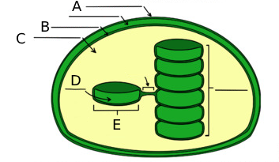

# Module 8 Test: Cellular Energy, Respiration, and Photosynthesis

## Multiple Choice

1. Which of the following is one of the ways that cellular respiration and photosynthesis are opposite processes?

    1. Photosynthesis releases energy, and cellular respiration stores energy.
    2. **Photosynthesis engages in carbon fixation, and cellular respiration engages in carbon release.**
    3. Photosynthesis removes oxygen from the atmosphere, and cellular respiration puts it back.
    4. Photosynthesis consumes glucose, and cellular respiration produces glucose.
    5. Photosynthesis converts light energy to chemical energy, and cellular respiration converts chemical energy to light energy.

2. Which of the following statements is TRUE for both types of fermentation?

    1. **The regeneration of NAD+ allows for glycolysis to continue.**
    2. Pyruvate molecules are broken down into lactic acid.
    3. Oxygen is required as a reactant.
    4. Carbon dioxide is released as a by-product.
    5. The electron transport chain is involved to produce ATP.

3. Look at the figure below. All the following are parts of an ADP molecule except

    

    1. Structure A
    2. Structure B
    3. Structure C
    4. **Structure D**
    5. Both Cand D

4. What process do the arrows for oxygen going in and water coming out represent in the diagram of the mitochondria?

    

    1. **Electron Transport Chain**
    2. Fermentation
    3. Glycolysis
    4. Krebs Cycle
    5. Calvin Cycle

5. Which structure in the mitochondria shown below is where H+ (protons) is transported to create a gradient for ATP synthesis?

    

    1. A
    2. B
    3. **C**
    4. D

6. Imagine that the y-axis of each graph in the figure below represents the rate of photosynthesis and the x-axis represents the temperature from 0°C to 35°C. The optimal water temperature for aquatic plants for photosynthesis is between 25°C and 32°C. Which of the following graphs best represents the effect of water temperature on the rate of photosynthesis in aquatic plants?

    

    1. A
    2. B
    3. **C**
    4. D

7. Correctly order the steps for Electron Transport Chain process in cellular respiration.

    I. Oxygen functions as the electron acceptor in the process. 
    II. The electron carrier molecules bring high energy electrons to protein pumps to transport protons. 
    III. The pumps in the inner membrane transport protons actively to the intermembrane space. 
    IV. H+ ions flow down their concentration gradient through the ATP Synthase to generate ATP. 

    1. IV, II, III, I
    2. **II, III, I, IV**
    3. II, IV, III, I
    4. III, II, I, IV
    5. III, IV, II, I

8. Where in the chloroplast are NADPH and ATP used to begin to modify $CO_2$ into G3P?

    

    1. A
    2. B
    3. **C**
    4. D
    5. E

9. Correctly order the steps for photosynthesis:

    I. $H^+$ ions flow down their concentration gradient through the ATP Synthase to generate ATP. 
    II. The ATP and electron carriers proceed to be used in the light independent reaction. 
    III, $CO_2$ enters the Calvin Cycle with the help of an enzyme and using energy harnessed from light, G3P is made. 
    IV. With light, pigments receive sunlight and hydrolyze water, allowing electrons to create $H^+$ concentration gradient for ATP production. 

    1. II, I, IV, III
    2. I, II, III, IV
    3. II, III, I, IV
    4. **IV, I, II, III**

10. During the light-dependent reaction, which reactants are used?

    I. ADP
    II. NADH
    III. Carbon dioxide
    IV. Water
    V. $NADP^+$
    VI. Oxygen
    VII. $NAD^+$
    VIII. ATP

    1. **I, IV, and V**
    2. I, IV, VII
    3. II, VI, VIII
    4. II, III, VII
    5. III, V, VIII

11. Comparing mitochondria and chloroplast, which of the following statements is/are TRUE? Select all possible choice(s).

    1. Mitochondria has an inner and outer membrane, but chloroplast only has an outer membrane and thylakoid membrane.
    2. **Chloroplast generates a lot of ATP that is used for G3P production, while mitochondria generates a lot of ATP for use as cellular energy.**
    3. Mitochondria and chloroplast have both types of electron transport molecules, NADH/NADPH and $FADH_2$/$FADPH_2$.
    4. **Both mitochondria and chloroplast utilize H+ concentration gradient to create ATP through ATP synthase.**

12. Which of the following statements is/are TRUE about glycolysis? Select all possible choice(s).

    1. **The process does not require oxygen.**
    2. **The process occurs in the cytoplasm.**
    3. The process is the first step of aerobic respiration but not anaerobic respiration.
    4. **The process requires electron carriers to be available.**
    5. **The process occurs in both prokaryotes and eukaryotes.**