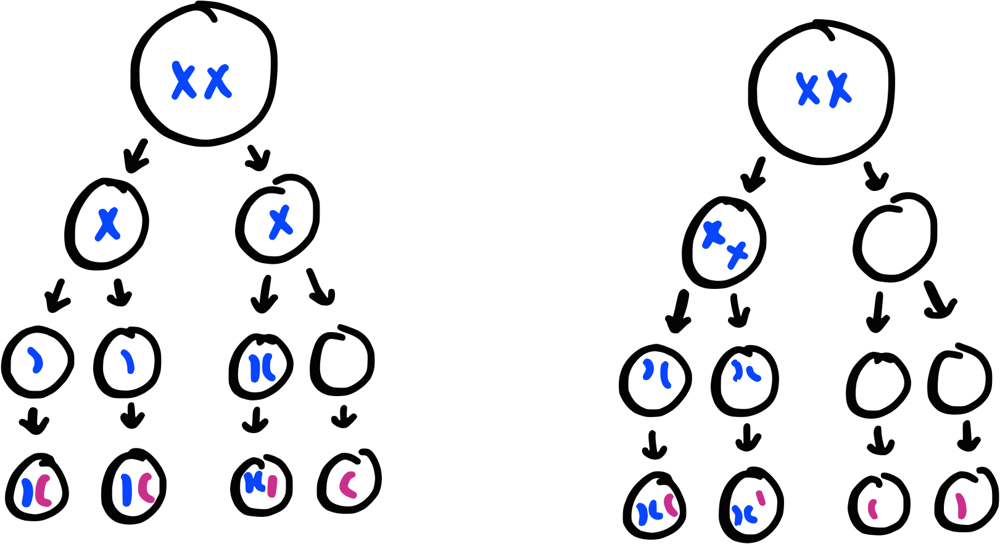

# Module 9 Lesson 2 Progress Check

## Prompt

Answer the "Check Your Progress" questions (p244 #2,3,6,7)

## Response

1. **Assess** how meiosis contributes to genetic variation, while mitosis does not.

    Meiosis contributes to genetic diversity through processes like crossing over and independent assortment, creating unique combinations of genes. In contrast, mitosis results in genetically identical daughter cells and does not contribute to genetic variation.

2. **Illustrate** how nondisjunction occurs during meiosis.

    Nondisjunction during meiosis occurs when chromosomes fail to separate properly, leading to gametes with abnormal chromosome numbers. This can happen in either Meiosis I (homologous chromosomes not separating) or Meiosis II (sister chromatids not separating).

    

3. **Compare and contrast** mitosis and meiosis by creating a venn diagram.

    | Mitosis                                                                                                                                                                                                                                                                                                                                       | Similarities                                                                                                                                                                                                | Meiosis                                                                                                                                                                                                                                                                                                                                          |
    |-----------------------------------------------------------------------------------------------------------------------------------------------------------------------------------------------------------------------------------------------------------------------------------------------------------------------------------------------|-------------------------------------------------------------------------------------------------------------------------------------------------------------------------------------------------------------|--------------------------------------------------------------------------------------------------------------------------------------------------------------------------------------------------------------------------------------------------------------------------------------------------------------------------------------------------|
    | - Produces two genetically identical daughter cells - Involves one cell division - Occurs in somatic cells - Purpose is growth, repair, and asexual reproduction - Maintains the same chromosome number as the parent cell (diploid) - No crossing over or genetic recombination - No independent assortment of chromosomes | - Both are forms of cell division - Both start from a single parent cell - Both go through stages of prophase, metaphase, anaphase, and telophase - Both involve DNA replication prior to division | - Produces four genetically diverse gametes - Involves two cell divisions - Occurs in germ cells for sexual reproduction - Introduces genetic variation - Reduces the chromosome number by half (haploid) - Crossing over and recombination occur during prophase I - Independent assortment of chromosomes during metaphase I |

4. **Conduct research** on the nondisjunction other than trisomy 21. Write a paragraph about your findings.

    Nondisjunction can lead to several genetic disorders other than trisomy 21, such as Turner Syndrome (monosomy X), Klinefelter Syndrome (47, XXY), and Edwards Syndrome (trisomy 18). These conditions result from an abnormal number of chromosomes and can have significant developmental and health impacts.