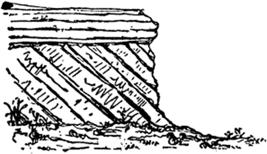
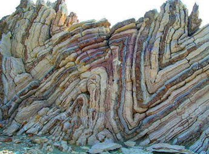
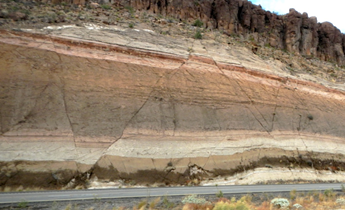

# 2.2: Relative Dating

1. The dating of rocks due to the number of layers
2. The Law of Superposition
    1. Younger rocks lie above older rocks if the layers haven't been disturbed
3. Tilting: When Earth's forces move rock layers up or down

    

4. Folding: Rocks are squeezed together

    

5. Faults: A crack in Earth's crust

    

6. Intrusions: A rock injected into another rock