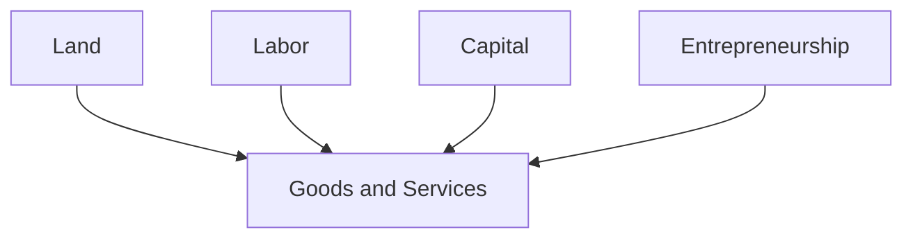
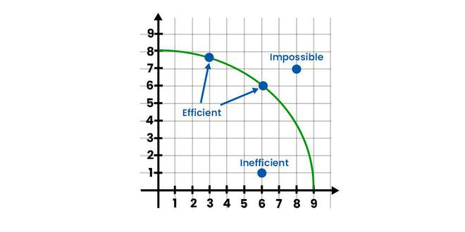

# Chapter 2: Factors of Production
How can we satisfy economic wants?

## Capital
### Financial Capital
Money used in the production of goods & services

### Physical Capital
Goods and services used in the production of other goods & services

## Entrepreneurship
Ability to combine land, labor, and capital in new ways to produce goods & services

### Types of Entrepreneurship

#### Innovator
Thinks of ways to use new inventions, technologies, or techniques to into goods & services

#### Strategist
Supplies vision and key decisions to set direction for new businesses

#### Risk-Taker
Not afraid to put in the time, effort, and resources not knowing if they will succeed

#### Sparkplug
Supplies the energy, determination, and enthusiasm needed to turn ideas into reality

## Productivity
### Production Equation

Producitivty Ratio
$$
\frac{\text{Output}}{\text{Input}}
$$

!!! question "How can we increase productivity?"
    - Increase the amount of resources
    - Increase the amount of output
    - Increase the amount of output per unit of input

## Choices
### Utility
Satisfaction one gains from the consumption of a good or service

### Marginal Utility
Satisfaction from the consumption of one or more unit

### Law of Diminished Marginal Utility
As you consume more units of any good or service, the additional satisfaction from each additional unit will eventually start to decrease

## Opportunity Cost
Value of the next best alternative you could have chosen

Knowing the cost or value of your choices can help you make a decision now

## Production Possibility Frontier
An economic model that shows (at the moment) all combinations of how an economy might use its reousrces to produce two goods

### Economic Efficiency
Using resources to produce the maximum amount of goods and services

#### Production Possibility Curve

Represents the maximum amount of goods and services that can be produced using a fixed amount of resources

- Any point along the curve that meets the needed demand is allocative efficient
- Any point along the curve that minimizes costs is productive efficient
- Anything inside the curve is economically inefficient
- Anything outside the curve is unattainable 

### Shifters of the PPC
- Change in the quantity of resources
- Change in the quality of resources
- Change in technology
- Change in trade
