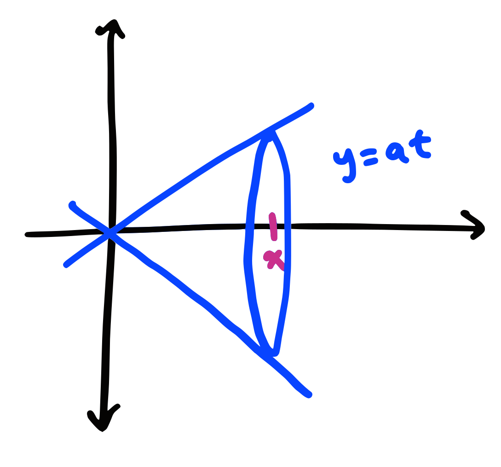
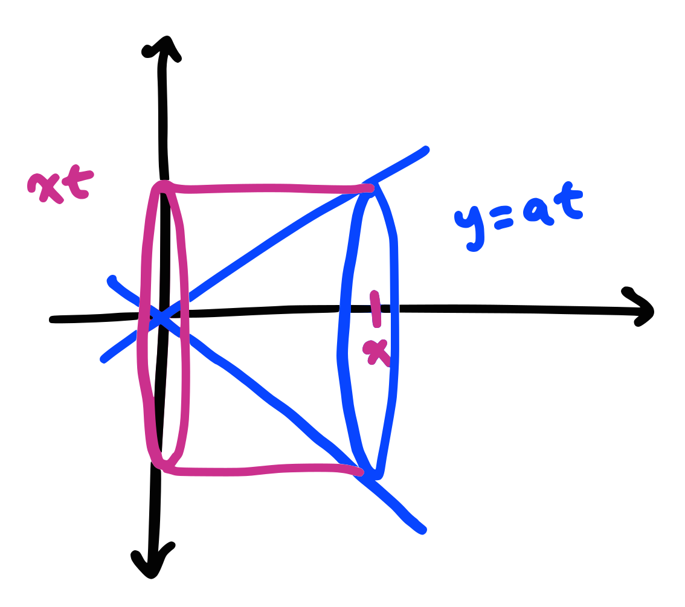

# Volume Ratios

This take home quiz will revolve around volumes and the cylinder that it is taken from (also, did you notice the pun?)

1. Let the function $f(t) = at$ where $a$ is a positive real number. If we revolve the area under the curve from $0 \leq t \leq x$, where x is a positive real number, around the x-axis, it will create a familiar shape. Draw a sketch of this situation on a set of axes. What is the volume of this solid, in terms of $x$?

    { width="240" align="left" }

    $$
    \begin{align}
    V(x) &= \pi \int_0^x f^2(t) dt\\
    &= \pi \int_0^x (at)^2 dt\\
    &= \pi a^2 \int_0^x t^2 dt\\
    &= \pi a^2 \left[\frac{t^3}{3}\right]_0^x\\
    &= \frac{\pi}{3}a^2x^3
    \end{align}
    $$

2. Now consider the cylinder that is created when revolving the region under the constant function $y=f(x)$ (where $f$ is the function from before) in the first quadrant around the x-axis. Draw this cylinder on the same set of axes as before. What is the ratio of the volume of the familiar shape to the cylinder? (Hint: You should recognize that you just proved a formula from geometry).

    { width="240" align="left" }

    $$
    \begin{align}
    C(x) &= \pi x \int_0^x f^2(x)dt\\
    &= \pi x \cdot (ax)^2\\
    &= \pi a^2 x^3\\\\
    \frac{V(x)}{C(x)} &= \frac{\frac{\pi}{3}a^2x^3}{\pi a^2 x^3}\\
    &= \frac{1}{3}
    \end{align}
    $$

3. Now let $g(t)=at^3$. Find the ratio of the solid formed when revolving the region under $g(t)$ from $0 \leq t \leq x$ around the x-axis to the cylinder that it "sits" in.

    $$
    \begin{align}
    \pi \int_0^x g(t)^2 dt &= \pi \int_0^x (at^3)^2 dt\\
    &= \pi a^2 \int_0^x t^6 dt\\
    &= \pi a^2 \left[\frac{t^7}{7}\right]_0^x\\
    &= \frac{\pi}{7}a^2x^7\\\\
    C_2(x) &= \pi x \int_0^x g(x)^2 dt\\
    &= \pi x \cdot (ax^3)^2\\
    &= \pi a^2 x^7\\\\
    \frac{V(x)}{C_2(x)} &= \frac{\frac{\pi}{7}a^2x^7}{\pi a^2 x^7}\\
    &= \frac{1}{7}
    \end{align}
    $$

4. Let $h(t) = a \sqrt{t}$. Do the same thing as the previous question.

    $$
    \begin{align}
    \pi \int_0^x h(t)^2 dt &= \pi \int_0^x (a\sqrt{t})^2 dt\\
    &= \pi a^2 \int_0^x t dt\\
    &= \pi a^2 \left[\frac{t^2}{2}\right]_0^x\\
    &= \frac{\pi}{2}a^2x^2\\\\
    C_3(x) &= \pi x \int_0^x h(x)^2 dt\\
    &= \pi x \cdot (a\sqrt{x})^2\\
    &= \pi a^2 x^2\\\\
    \frac{V(x)}{C_3(x)} &= \frac{\frac{\pi}{2}a^2x^2}{\pi a^2 x^2}\\
    &= \frac{1}{2}
    \end{align}
    $$

5. Show that for any power function of the form $f(t) = at^k$, where $a$ and $k$ are positive real numbers, that the ratio of the volume and the cylinder that it "sits" in is always a constant.

    $$
    \begin{align}
    \pi \int_0^x f(t)^2 dt &= \pi \int_0^x (at^k)^2 dt\\
    &= \pi a^2 \int_0^x t^{2k} dt\\
    &= \pi a^2 \left[\frac{t^{2k+1}}{2k+1}\right]_0^x\\
    &= \frac{\pi}{2k+1}a^2x^{2k+1}\\\\
    C_4(x) &= \pi x \int_0^x f(x)^2 dt\\
    &= \pi x \cdot (ax^k)^2\\
    &= \pi a^2 x^{2k+1}\\\\
    \frac{V(x)}{C_4(x)} &= \frac{\frac{\pi}{2k+1}a^2x^{2k+1}}{\pi a^2 x^{2k+1}}\\
    &= \frac{1}{2k+1}
    \end{align}
    $$

Let $V(x)$ be the volumes that you found before and $C(x)$ be the cylinders that you used before. You've shown $\frac{V(x)}{C(x)}$ should be constant for power functions. Now we're going to prove a more interesting result.

1. Let $y = f$ be a positive, increasing, twice-differentiable function. Let $\frac{V(x)}{C(x)} = Q$, which is a constant Q. Differentiate both sides to show that $V = \frac{cv'}{c'}$

    $$
    \begin{align}
    \frac{d}{dx}\left[\frac{V(x)}{C(x)}\right] &= \frac{d}{dx}Q\\
    \frac{C(x)V'(x)-V(x)C'(x)}{C(x)^2} &= 0\\
    C(x)V'(x)-V(x)C'(x) &= 0\\
    C(x)V'(x) &= V(x)C'(x)\\\\
    V(x) &= \frac{C(x)V'(x)}{C'(x)} \quad \blacksquare
    \end{align}
    $$

2. Use $C(x)=\pi x\cdot f^2(x)$ and $V(x) = \int_0^x \pi f^2(t) dt$. What is $V'$?

    $$
    \begin{align}
    \frac{d}{dx}V(x) &= \frac{d}{dx}\int_0^x \pi f^2(t) dt\\
    &= \pi f^2(x)
    \end{align}
    $$

3. Let $y=f(x)$. If $V = \frac{cv'}{c'}$, show by implicit differentiation that

    $$
    \begin{align}
    y^2= \frac{(y+2xy')(3xy^2y'+y^3)-(xy^3)(3y'+2xy'')}{(y+2xy')^2}\\\\
    \end{align}
    $$

$$
\begin{align}
V'(x) &= (\frac{cv'}{c'})'\\
&= \frac{c'[c'v' + cv''] -  cv'c''}{(c')^2}\\\\
C'(x) &= (\pi y^2) + 2\pi xyy'\\
&= \pi y(y + 2xy')\\\\
C''(x) &= 2\pi yy' + 2\pi yy' + 2 \pi x (y')^2 + 2\pi x yy''\\
&= 2\pi (2 yy' + x(y')^2 + xy'')\\\\
V'(x) &= \pi y^2\\
V''(x) &= 2\pi yy'\\\\
\end{align}
$$

$$
\begin{align}
\small y^2 = \frac{(y+2xy')[(y+2xy')(\pi y) + (\pi xy^2)(2\pi yy') - (\pi x y^2)(\pi y^2)(2\pi) (2 yy' + x(y')^2 + xy''))(y)]}{(y+2xy')^2}
\end{align}
$$

$$
\begin{align}
y^{2}&=\frac{y^{4}+2xy^{3}y^{\prime}+6x^{2}y^{2}(y)^{2}-2x^{2}y^{3}y^{\prime\prime}}{(y+2xy^{\prime})^{2}}\\\\
&= (y+2xy^{\prime})(3xy^{2}y^{\prime}+y^{3})-(xy^{3})(3y+2xy^{\prime\prime}) \\
&=3xy^{3}y^{\prime}+y^{4}+6x^{2}y^{2}(y^{\prime})^{2}+2xy^{3}y^{\prime} -3xy3y'-2x^2y^3y''\\
&=y^{4}+2xy^{3}y^{\prime}+6x^{2}y^{2}(y^{\prime})^{2}-2x^{2}y^{5}y^{\prime\prime}\\
&\text{ Expansion is equivalent to the original equation} \quad \blacksquare
\end{align}
$$

4. Now show that the above simplifies to $xyy'' - xy'^2$

$$
\begin{align}
\end{align}
$$

5. Divide both sides by $xyy'$ and then integrate. (Hint: If you're confused, use a u-sub)

$$
\begin{align}
\end{align}
$$

6. Solve the result for $\frac{y'}{y}$ and then integrate again. You should have shown something interesting about power functions.

$$
\begin{align}
\end{align}
$$
