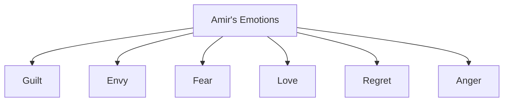
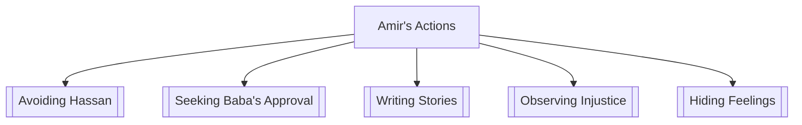

# Chapter 8-9

## Quotes

Record at least 5 quotes from your assigned reading. Include page numbers in the next column.

Respond, using a variety of reflection types. Use the codes above to label your responses and try to include a variety of different reflections.

- Question: Pose a question or record something that confuses you so far.
- Understand: Explain how a previous question or uncertainty has been answered for you.
- Evaluate: Make a judgment on the character's actions, the author's message, or another facet of the text.
- Reflect: Apply the quote to a broader theme or universal conflict. What does it tell you about the human condition?
- Your World: Make a connection between the text and your life or experiences.

| Quote                                                                                                                                          | Response                                                                                                                                                                                                                                                             |
|------------------------------------------------------------------------------------------------------------------------------------------------|----------------------------------------------------------------------------------------------------------------------------------------------------------------------------------------------------------------------------------------------------------------------|
| "Where were you? I looked for you" I said. Speaking those words was like chewing on a rock.                                                    | Reflect: This quote captures the universal struggle of confronting someone we care about after a difficult or disappointing event. It speaks to the broader human experience of how challenging and uncomfortable it can be to address unresolved emotions or guilt. |
| "Agha sahib will worry" was all he said. He turned from me and limped away.                                                                    | Evaluate: This reflects a common theme of selflessness and prioritizing the well-being of others, often at personal cost. It highlights a universal aspect of human character where loyalty and concern for others override personal suffering.                      |
| "I opened the door to the smoky study and stepped in. Baba and Rahim Khan were drinking tea and listening to the news crackling on the radio." | Your World: This scene is reminiscent of those moments in life where simplicity and familiarity bring comfort. It's a universal experience to find solace in ordinary, everyday activities that create a sense of belonging and peace.                               |
| "I watched Hassan get raped," I said to no one. Baba stirred in his sleep.                                                                     | Question: This raises a universal question about human behavior in crisis situations. Why do people sometimes remain passive in the face of wrongdoing? It delves into the complexities of human psychology, particularly the aspects of fear and moral conflict.    |
| "In his arms, I forgot what I'd done. And that was good."                                                                                      | Reflect: This quote speaks to a common human desire to seek escape from our own mistakes and guilt. It reflects a universal aspect of human nature, where comfort and solace from others is sought as a respite from personal remorse or regret.                     |

## Complex Characters

Character complexity is not as difficult as it sounds. Complexity simply means more than one item is happening simultaneously, creating contrast between the two. Character complexity is when a character feels two contrasting emotions or does two contrasting actions.

To brainstorm complexity, fill in the bubbles around Amer. first with ull I of his emotions sa far and then with all actions. Work to fill each bubble. An example has been provided for you for Hassan

After you're done, use the space at the bottom to write a claim about Amir's complexity, Try one for both his emotions and his actions.

!!! example

    ```mermaid
    graph
        A[Hasaan's Emotions] --> Powerlessness
        A --> Loyalty
        A --> Shame
        A --> Love
        A --> Pride
        A --> Fear
    ```

    By standing up to Assef, Hassan demonstrates his strength and pride in winning the final kite. However, this moment also instills feelings of great shame, overwhelming his feelings of pride and victory.

### Amir's Emotions


Amir's emotional complexity, marked by a blend of love and envy for Hassan, drives him towards betrayal and dishonesty in a quest for his father's approval, revealing the intricate interplay of human emotions where love coexists with regrettable actions.

### Amir's Actions


Amir's quest for his father's approval and moral struggles manifest in his kite flying and writing, yet clash with his betrayal of Hassan, illustrating the intricate dance of human desires and moral dilemmas.
