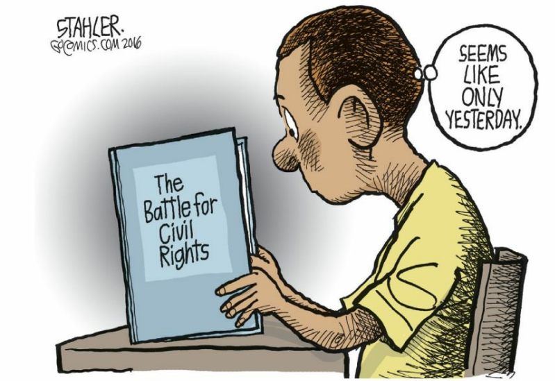

# C8 AP Exam Practice

## Multiple Choice Questions

!!! quote "Brown v. Board of Education, 347 U.S. 493 (1954)"

    Today, education is perhaps the most important function of state and local governments. Compulsory school attendance laws and the great expenditures for education both demonstrate our recognition of the importance of education to our democratic society. It is required in the performance of our most basic public responsibilities, even service in the armed forces. It is the very foundation of good citizenship. Today it is a principal instrument in awakening the child to cultural values, in preparing him for later professional training, and in helping him to adjust normally to his environment. In these days, it is doubtful that any child may reasonably be expected to succeed in life if he is denied the opportunity of an education. Such an opportunity, where the state has undertaken to provide it, is a right which must be made available to all on equal terms.

1. Which of the following constitutional principles are addressed in the quote?
    1. **due process and equal protection**
    2. due process and federalism
    3. judicial review and due process
    4. federalism and equal protection

   

2.  Which of the following best describes the viewpoint in the cartoon?
    1. **The struggle for civil rights is ongoing.**
    2. The civil rights movement is relatively new.
    3. Many schools are still segregated by race.
    4. Schools should teach students about the civil rights movement.

## Argumentative Question

### Prompt

In United States v. Virginia (1996), the U.S. Supreme Court analyzed whether Virginia’s admissions policy to one of its state universities, the Virginia Military Institute (VMI), was unconstitutional because it restricted admissions to males. In describing the facts of that case, the Court noted the following:

!!! quote "United States v. Virginia, 518 U.S. 515 (1996)."

    Founded in 1839, VMI is today the sole single-sex school among
    Virginia’s 15 public institutions of higher learning. VMI’s distinctive
    mission is to produce “citizen-soldiers,” men prepared for leadership
    in civilian life and in military service. VMI pursues this mission
    through pervasive training of a kind not available anywhere else in
    Virginia. Assigning prime place to character development, VMI uses
    an “adversative method” modeled on English public schools and
    once characteristic of military instruction. VMI constantly endeavors
    to instill physical and mental discipline in its cadets and impart to
    them a strong moral code. The school’s graduates leave VMI with
    heightened comprehension of their capacity to deal with duress and
    stress, and a large sense of accomplishment for completing the
    hazardous course.

Develop an argument whether VMI’s single-sex admissions policy is constitutional.

In your essay:

- Articulate a claim or thesis that responds to the prompt, and use a line of reasoning to defend it.
- Use at least TWO pieces of relevant and accurate evidence to support your claim.
- At least ONE piece of evidence must be from one of the listed foundational documents.
    - Brutus No. 1
    - United States Constitution
    - Federalist No. 78
- Use a second piece of evidence from another foundational document from the list or from your study of civil rights.
- Use reasoning to explain why the evidence you provided supports your claim or thesis.
- Use refutation, concession, or rebuttal to respond to an opposing or alternative perspective

### Response

The Virginia Military Institute's (VMI) single-sex admissions policy violates the Equal Protection Clause of the Fourteenth Amendment of the United States Constitution, which requires that no state deny any person within its jurisdiction equal protection of the laws. This foundational principle mandates equality under the law, making gender-based exclusion in public education unconstitutional. Federalist No. 78 supports this by emphasizing the judiciary's duty to overturn laws and policies conflicting with the Constitution, asserting that VMI's exclusion of women based on gender must be deemed unconstitutional. Furthermore, the Supreme Court case Brown v. Board of Education reinforces the argument by demonstrating that separate educational facilities—and, by extension, programs—are inherently unequal. While the benefits of single-sex education can be acknowledged, they do not justify a public institution's discrimination based on gender. Equal Protection demands that state actions serve a compelling interest and be narrowly tailored to achieve that interest, criteria VMI's policy does not meet. The policy unjustifiably excludes women from receiving VMI's unique educational benefits, failing the standard of narrow tailoring. Therefore, VMI's admissions policy is unconstitutional as it discriminates based on gender, undermining the principle of equal access to public education.