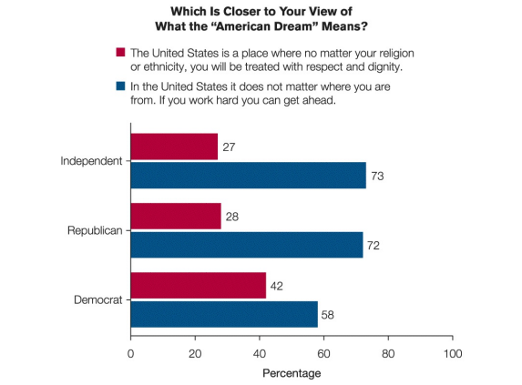

# FRQ Practice 1.1 - 1.2

## 1.1

1. Describe the purpose of the EAA.

    The purpose of the Educational Accountability Act is to ensure accountability in educational institutions, typically focusing on the quality and effectiveness of teaching, learning outcomes, and the efficient use of resources.

2. In the context of the scenario, explain how students who believe their rights have been denied can assert their rights?

    In the context of the scenario, students who believe their rights have been denied under the EAA can assert their rights by filing complaints with relevant educational authorities, seeking legal advice, or utilizing grievance procedures established by their educational institution.

3. Explain how efforts to enforce the EAA illustrates the tensions between protecting liberty and establishing order. 

    Efforts to enforce the EAA illustrate tensions between protecting liberty and establishing order by highlighting the balance between individual freedoms (like academic freedom or freedom of expression) and the need for structured, standardized educational systems to maintain quality and order in the educational process.

## 1.2

1. Identify the most common belief about the American dream shown in the bar chart.

   The most common belief about the American dream is that in the United States, if you work hard, you can get ahead, regardless of where you are from. This belief is indicated by the higher blue values across all groups (Independent, Republican, and Democrat).

2. Describe the differences between Democrats and Republicans based on their views of the American Dream, using the chart.

   The differences between Democrats and Republicans based on their views of the American Dream are relatively slight but notable. Democrats appear to place slightly more emphasis on the United States being a place of respect and dignity for people of all religions and ethnicities (42% for Democrats vs. 28% for Republicans), while Republicans, like Independents, more strongly believe in the idea of getting ahead through hard work.

3. Explain how the data in the chart could be used by a candidate running for office.

   A candidate running for office could use the data in the chart to tailor their campaign messages to resonate with the beliefs of their target voter groups. For instance, they might emphasize themes of hard work and opportunity to appeal to Republicans and Independents, and focus more on messages of inclusivity and respect for diversity to appeal to Democrats.

4. Explain why it is difficult to measure beliefs about the American dream. 

   Measuring beliefs about the American dream is difficult because it encompasses a wide range of subjective and personal ideals that can vary greatly among individuals. Additionally, the American Dream is a culturally and emotionally charged concept, making it challenging to capture and quantify through simple survey questions.