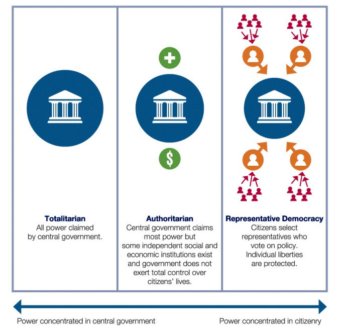

# FRQ Practice 1.3 - 1.4

## 1.3 Competing Theories of Democracy

!!! quote "Donald Trump, excerpts from campaign speech in Monessen, Pennsylvania, June 28, 2016."
    Our politicians have aggressively pursued a policy of globalization—moving our jobs, our wealth, and our factories to Mexico and overseas. Globalization has made . . . politicians very wealthy. But it has left millions of our workers with nothing but poverty and heartache.

Three models of representative democracy—participatory, pluralist, and elite—have been used to describe American democracy. After reading the quotation, please respond to parts A, B, and C.

1. Describe the model of democracy that is best represented in the quotation.

    The quotation aligns with the "elite model" of democracy, where a small group of elites, including politicians and corporate leaders, control political power and benefit from globalization policies while leaving the broader population, particularly workers, in poverty and heartache.

2. Describe a different model of democracy from the model you described in part 1.

    In contrast to the elite model, the "pluralist model" of democracy emphasizes the role of various interest groups and civil society organizations in influencing government decisions through negotiation and compromise, rather than a small elite group dominating decision-making.

3. Explain one reason why civil society is a cornerstone of the participatory and pluralist models of democracy.

    Civil society is a cornerstone of the participatory and pluralist models of democracy because it fosters citizen engagement and ensures diverse voices are represented in the political process, either through active citizen participation in the participatory model or by providing a channel for various interests and perspectives to influence government policies in the pluralist model.

## 1.4 Institutions, Systems, and Power

Use the graphic and your knowledge of U.S. Government and Politics to answer parts A, B, and C.

1. Define constitutional republic.

    A constitutional republic is a form of government where the constitution is the supreme law, providing a framework for governance and protecting individual rights, with elected representatives accountable to the people.

2. Describe how the Preamble of the Declaration of Independence illustrates the concept of natural rights.

    The Preamble of the Declaration of Independence asserts that individuals have inherent, unalienable rights such as life, liberty, and the pursuit of happiness, emphasizing the concept of natural rights as the foundation of the United States.

3. Explain one way in which the national government’s role in establishing order creates tension with its role in protecting fundamental rights.

    The tension arises when the national government's efforts to establish order, especially during crises, may encroach upon civil liberties, like increased surveillance or restrictions on freedom of speech, raising concerns about the balance between security and individual rights.

