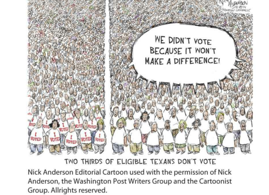

# C13 AP Exam Practice

## Free Response Questions

1. Use the cartoon and your knowledge of U.S. Government and Politics to answer parts A, B, and C.
    1. Describe the viewpoint expressed in the cartoon.

        The cartoon expresses the viewpoint that a significant number of eligible voters choose not to participate in the electoral process because they believe their vote will not have an impact. This suggests a sense of apathy or disillusionment with the political system among a large portion of the population. It also implies that this mindset contributes to low voter turnout rates, which could potentially undermine the democratic process by not reflecting the will of the broader populace.

    2. Explain one reason why voting is important in a democracy.

        Voting is important in a democracy because it is the fundamental way in which citizens exercise their power to influence government decisions and policy directions. Each vote contributes to determining who will hold public office and make critical decisions on behalf of the people. Voting ensures that elected officials are accountable to the populace, and it legitimizes the democratic process by reflecting the will of the electorate. When citizens vote, they engage in civic responsibility and uphold the democratic principle that power ultimately rests with the people.

    3. Describe one proposal to increase voter turnout rates.

        One proposal to increase voter turnout rates is to make Election Day a national holiday. This would aim to address the problem of individuals not voting due to work or school commitments, which can make it difficult to find time to go to the polls. With a national holiday, more people would have the day off, thus removing a significant barrier to voting. Other proposals often discussed include expanding early voting, implementing automatic voter registration, offering same-day registration, and improving access to mail-in ballots.

2. Head Count is a voter-registration drive aimed at young people. Following a march to end gun violence held in March, 2018, in Washington, D.C, members of Head Count raised their fists and chanted “demonstration without registration leads to frustration” before sending out volunteers with clipboards to sign up new voters.

    Use the scenario and your knowledge of U.S. Government and Politics to answer parts A, B, and C.

    1. Describe the viewpoint expressed in by members of Head Count in the scenario.

        The viewpoint expressed by members of Head Count in the scenario is that political demonstrations, such as protests against gun violence, should be coupled with concrete actions like voter registration to be fully effective. Their chant, “demonstration without registration leads to frustration,” suggests that they believe without the ability to influence political decisions through voting, demonstrations may not lead to substantial policy change. Thus, they advocate for turning the energy and participation in social movements into electoral power by registering more voters, particularly among young people who are often underrepresented at the polls.

    2. Describe one policy a state might enact to address the issue described in the scenario.

        One policy a state might enact to address the issue of low voter registration, especially among young participants in political demonstrations, is to implement same-day voter registration. This policy would allow individuals to register to vote on the same day as an election, at their voting location. Same-day registration can significantly lower barriers for young people and first-time voters who may miss traditional registration deadlines. By making registration more accessible and convenient, states can encourage higher voter turnout and ensure that the voices of more citizens, including those actively involved in demonstrations, are heard in electoral processes.

    3. Explain one reason why a citizen might attend a demonstration but not register to vote.

        One reason why a citizen might attend a demonstration but not register to vote is a sense of disillusionment or skepticism about the electoral process. Some individuals may feel that their vote does not matter or that political outcomes will not change regardless of their participation in voting. This sentiment can be particularly prevalent among young people or minority groups who feel marginalized or unrepresented by the candidates or the current political system. As a result, they might engage in direct action like protests to express their views and demands for change, seeing it as a more immediate or impactful form of activism compared to participating in what they perceive as a flawed or ineffective electoral system.

## Argumentative Essay 

### Prompt

Although there have been several efforts to limit the role on money in politics, campaign spending continues to increase. Discuss whether increased campaign spending threatens representative democracy. In your essay:

- Articulate a claim or thesis that responds to the prompt, and use a line of reasoning to defend it.
- Use at least TWO pieces of relevant and accurate evidence to support your claim.
- At least ONE piece of evidence must be from one of the listed foundational documents:
    - Constitution of the United States
    - Federalist No. 10
    - Federalist No. 78
- Use a second piece of evidence from another foundational document from the list or from your study of elections and campaigns.
- Use reasoning to explain why the evidence you provided supports your claim or thesis.
- Use refutation, concession, or rebuttal to respond to an opposing or alternative perspective.

## Response
