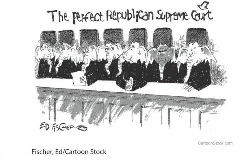

# C6 AP Exam Practice

## Multiple Choice Questions

1. Which of the following is an example of judicial review by the Supreme Court?
    1. deciding a case of original jurisdiction between New Mexico and Nevada over the issue of water rights
    2. hearing a case of appellate jurisdiction involving different interpretations of a federal law by the Ninth and Tenth Circuit Courts
    3. **overturning a president’s executive order about immigration because the order violates the Constitution**
    4. hearing a case of appellate jurisdiction involving a contract dispute between a corporation and a labor union
2. Why is Marbury v. Madison significant?
    1. **It established the power of judicial review, affirming that the Supreme Court is coequal with other branches.**
    2. It established the power of the Supreme Court to overturn decisions by state supreme courts.
    3. It gives the Supreme Court more power than Congress because Congress has no way of overturning decisions by the court.
    4. It gives the Supreme Court the power to make decisions that serve as precedent for similar cases in the future.

    

3. Which of the following statements best describes the viewpoint in the cartoon?
    1. Republicans are more partisan than Democrats in nominating and confirming Supreme Court justices.
    2. **Political parties attempt to nominate justices who share their political ideology.**
    3. Supreme Court justices serve for life, and their appointment impacts decisions for a long time.
    4. Once justices are appointed to the Supreme Court, they pressure each other to adopt similar viewpoints.
4. The Constitution is “not a living document,” [Justice Scalia] told the Southern Methodist University crowd in 2014. “It’s dead, dead, dead... The judge who always likes the results he reaches is a bad
   judge.” The quote supports which philosophy?
    1. **judicial restraint**
    2. judicial activism
    3. judicial independence
    4. judicial review

    !!! quote "Federalist No. 81"
        There never can be danger that the judges, by a series of deliberate
        usurpations on the authority of the legislature, would hazard the
        united resentment of the body entrusted with it, while this body was
        possessed of the means of punishing their presumption, by degrading
        them from their stations 

        \- Alexander Hamilton, Federalist No. 81.

5. Which of the following statements summarizes the argument made in Federalist No. 81?
    1. The Supreme Court might deliberately take power away from Congress.
    2. Congress must trust the court system to uphold the Constitution.
    3. Congress may check the Supreme Court by publicly degrading its decisions.
    4. C**ongress may check the Supreme Court through impeachment.**
6. A Supreme Court Justice who writes the following words, “Generations from now, lawyers and judges will look back at today’s ruling with utter contempt,” is probably writing a
    1. concurring opinion
    2. majority opinion
    3. **dissenting opinion**
    4. per curiam opinion

    In Federalist No. 78, Alexander Hamilton wrote: Whoever attentively considers the different departments of power must perceive, that, in a government in which they are separated from each other, the judiciary, from the nature of its functions, will always be the least dangerous to the political rights of the Constitution; because it will be least in a capacity to annoy or injure them. The Executive not only dispenses the honors, but holds the sword of the community. The legislature not only commands the purse, but prescribes the rules by which the duties and rights of every citizen are to be regulated. The judiciary, on the contrary, has no influence over either the sword or the purse; no direction either of the strength or of the wealth of the society; and can take no active resolution whatever. It may truly be said to have neither FORCE nor WILL, but merely judgment; and must ultimately depend upon the aid of the executive arm even for the efficacy of its judgments.

7. Which of the following statements best describes Hamilton’s point of view?
    1. The executive is more powerful than the legislature or the judiciary because the president is commander in chief.
    2. **The judiciary’s power depends on an ability to convince the other branches of the strength of its reasoning.**
    3. Judicial review should not be used against Congress because it determines the duties and rights of Americans.
    4. Judges should examine cases involving only legal rights, and not cases addressing political rights such as voting and gerrymandering.
8. Which of the following examples best reflects the statement Hamilton made in the final sentence of the quote?
    1. **In 1957, President Dwight Eisenhower sent the National Guard to Little Rock, Arkansas to integrate the schools as ordered in Brown v. Board of Education (1954).**
    2. In his 2010 State of the Union address, President Barack Obama sharply criticized the Supreme Court’s decision in Citizens United v. Federal Election Commission (2010).
    3. In 2017, President Donald Trump nominated Neil Gorsuch to the Supreme Court, announcing he was “the very best judge in the country.”
    4. In 1983, President Ronald Reagan called for an amendment to overturn the Supreme Court’s decision in Roe v. Wade (1973).

    Supreme Court of the United States: Method of Disposition, 1970–2010

    | October Term | Petitions for certiorari granted | Cases argued | Cases disposed of by full opinion |
    |--------------|----------------------------------|--------------|-----------------------------------|
    | 1970         | 161                              | 151          | 126                               |
    | 1980         | 162                              | 144          | 144                               |
    | 1990         | 141                              | 121          | 121                               |
    | 2000         | 99                               | 86           | 83                                |
    | 2010         | 90                               | 86           | 83                                |

9. What is the most logical inference from the table, using data from
   the five years shown?
    1. **The Supreme Court has been accepting fewer cases for review.**
    2. The number of petitions for writ of certiorari has decreased.
    3. The Supreme Court has been issuing more opinions.
    4. The Supreme Court has heard more cases.
10. Which of the following best describes an inference that can be
    drawn from the table?
     1. Supreme Court Justices are more focused on writing books and in giving speeches than they are in making new law.
     2. As the Court resolves cases over time, fewer cases are being filed that address constitutional issues.
     3. **The Justices have decided over time that they should devote more of their limited resources to resolving a smaller number of increasingly hard cases.**
     4. Computerization has enabled the Justices to become more efficient over time.

## Free Response Questions

### Prompt

In United States v. Nixon (1974), the Supreme Court analyzed the scope of the president’s claim of executive privilege. The president was broadly claiming that his executive privilege extended to every conversation he had, even those related to criminal conduct. For that reason, the president argued, the courts could not examine any transcript or hear any tape of his conversations. In addressing that argument, the Court noted:

!!! quote
    [I]n Baker v. Carr ... the Court stated: “Deciding whether a matter has in any measure been committed by the Constitution to another branch of government, or whether the action of that branch exceeds whatever authority has been committed, is itself a delicate exercise in constitutional interpretation, and is a responsibility of this Court as ultimate interpreter of the Constitution.” Notwithstanding the deference each branch must accord the others, the “judicial Power of the United States” vested in the federal courts by Art. III, § 1, of the Constitution can no more be shared with the Executive Branch than the Chief Executive, for example, can share with the Judiciary the veto power, or the Congress share with the Judiciary the power to override a Presidential veto. Any other conclusion would be contrary to the basic concept of separation of powers and the checks and balances that flow from the scheme of a tripartite government ... We therefore reaffirm that it is the province and duty of this Court “to say what the law is” with respect to the claim of privilege presented in this case.

Use the quote and your understanding of U.S. Government and Politics to respond to parts 1, 2, and 3.

1. Describe one similarity between the Supreme Court’s ruling in United States v. Nixon (1974) and the Supreme Court’s ruling in Marbury v. Madison (1803).
2. Describe one difference between the Supreme Court’s ruling in United States v. Nixon (1974) and the Supreme Court’s ruling in Marbury v. Madison (1803).
3. Explain one way in which your answers in parts A and B relate to the “basic concept of separation of powers and the checks and balances that flow from the scheme of a tripartite government,” as stated in the quote.

### Response

1. One significant similarity between these two landmark Supreme Court decisions is their reinforcement of the principle of judicial review. In Marbury v. Madison, the Supreme Court, under Chief Justice John Marshall, established the doctrine of judicial review, asserting the Court's authority to declare laws unconstitutional, thereby affirming its role as the ultimate interpreter of the Constitution. Similarly, in United States v. Nixon, the Supreme Court asserted its authority to review executive actions and claims of executive privilege, especially when those claims interfere with judicial processes. This case reaffirmed the Court's role as an interpreter of the Constitution and emphasized that the judiciary has the power to limit the executive branch, ensuring that no branch of government, including the President, is above the law.
2. A key difference lies in the specific powers of the federal government being examined. Marbury v. Madison focused on the power of the Supreme Court to issue writs of mandamus and, more broadly, established the Court's power to review and nullify acts of Congress that it found to be in conflict with the Constitution. On the other hand, United States v. Nixon centered on the limits of the President's power, specifically the extent of executive privilege and whether the President could claim this privilege to withhold information in a criminal investigation. Thus, while both cases reinforced the judiciary's role in the system of checks and balances, Marbury v. Madison dealt with the judiciary's power over legislative acts, and United States v. Nixon addressed the judiciary's power to check the executive branch.
3. The answers to parts 1 and 2 illustrate the core principles of separation of powers and checks and balances within the U.S. government. The doctrine of judicial review established in Marbury v. Madison and the limitation on executive privilege determined in United States v. Nixon both underscore the judiciary's essential role in preventing the concentration of power in one branch of government. By asserting its authority to review laws and executive actions, the Supreme Court acts as a check on both the legislative and executive branches, ensuring that neither branch exceeds its constitutional authority. This interplay reflects the framers' intention to create a government in which power is distributed among three co-equal branches, each with distinct powers and responsibilities, yet each capable of restraining the others to maintain a balance of power and protect individual liberties.
