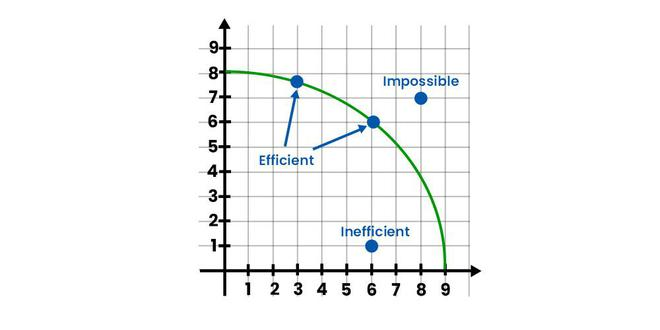

# Factors of Production

## The Five Steps of Economic Decision-Making

1. Define the problem. What is the decision that needs to be made?
2. Identify possible alternatives. What are the different options available?
3. Develop criteria and a ranking system. How will the alternatives be evaluated?
4. Evaluate alternatives against the criteria. Which alternative is the best?
5. Make a decision. Implement the chosen alternative.

## Economic Fundamentals
* **Our wants always exceed our resources.** We desire many things, but we can only afford to have a limited number of them.
* **The choices we make are influenced by our wants and our resources.** We have to decide what we want most and what we are willing to give up to get it.
* **The choices we make can have a big impact on our lives.** The decisions we make about our education, our careers, and our relationships can all affect our happiness and success.

## Scarcity
### Types of Scarcity

* Absolute scarcity means that there is not enough of a resource to meet everyone's needs.
* For example, there is not enough water for everyone in the world to have enough to drink.
* Relative scarcity means that there is not enough of a resource to meet everyone's wants.
* For example, there is not enough money for everyone in the world to have a private jet.

### The Causes of Scarcity
There are three main causes of scarcity:

* Limited resources: There are only a finite number of resources in the world.
* Unlimited wants: We have unlimited wants for goods and services.
* Different wants: People have different wants, and these wants often conflict with each other.

### The Consequences of Scarcity

* Scarcity forces us to make choices.
* We have to decide which of our wants are most important and which ones we can afford to give up.
* Scarcity also leads to competition.
* People compete for resources, and this can lead to conflict.

## Human Capital
Human capital is the skills and knowledge that people have that can be used to produce goods and services.

### Importance of Human Capital

* Human capital is important for economic growth.
* A more skilled workforce can produce more goods and services.
* Human capital can also help to reduce poverty.

### Ways to Increase Human Capital

* Education: Education is the most important way to increase human capital.
* Training: Training can help people to develop new skills and knowledge.
* Experience: Experience can also help people to develop skills and knowledge.

## Capital

* Capital is the tools, machines, and buildings used in the production of other goods and services.
* It can take a surprising number of forms, from simple screwdrivers to complex supercomputers.
* Capital has replaced labor in many industries, but it has also created new jobs in the design, production, and maintenance of new machines.

### Financial Capital
Money used in the production of goods & services

### Physical Capital
Goods and services used in the production of other goods & services

## Entrepreneurship
Ability to combine land, labor, and capital in new ways to produce goods & services

### Types of Entrepreneurship

#### Innovator
Thinks of ways to use new inventions, technologies, or techniques to into goods & services

#### Strategist
Supplies vision and key decisions to set direction for new businesses

#### Risk-Taker
Not afraid to put in the time, effort, and resources not knowing if they will succeed

#### Sparkplug
Supplies the energy, determination, and enthusiasm needed to turn ideas into reality

## Productivity
### Production Equation

Producitivty Ratio
$$
\frac{\text{Output}}{\text{Input}}
$$

!!! question "How can we increase productivity?"
    - Increase the amount of resources
    - Increase the amount of output
    - Increase the amount of output per unit of input

## Choices
### Utility
Satisfaction one gains from the consumption of a good or service

### Marginal Utility
Satisfaction from the consumption of one or more unit

### Law of Diminished Marginal Utility
As you consume more units of any good or service, the additional satisfaction from each additional unit will eventually start to decrease

## Opportunity Cost
Value of the next best alternative you could have chosen

Knowing the cost or value of your choices can help you make a decision now

## Production Possibility Frontier
An economic model that shows (at the moment) all combinations of how an economy might use its reousrces to produce two goods

### Economic Efficiency
Using resources to produce the maximum amount of goods and services

#### Production Possibility Curve

Represents the maximum amount of goods and services that can be produced using a fixed amount of resources

- Any point along the curve that meets the needed demand is allocative efficient
- Any point along the curve that minimizes costs is productive efficient
- Anything inside the curve is economically inefficient
- Anything outside the curve is unattainable 

### Shifters of the PPC
- Change in the quantity of resources
- Change in the quality of resources
- Change in technology
- Change in trade
