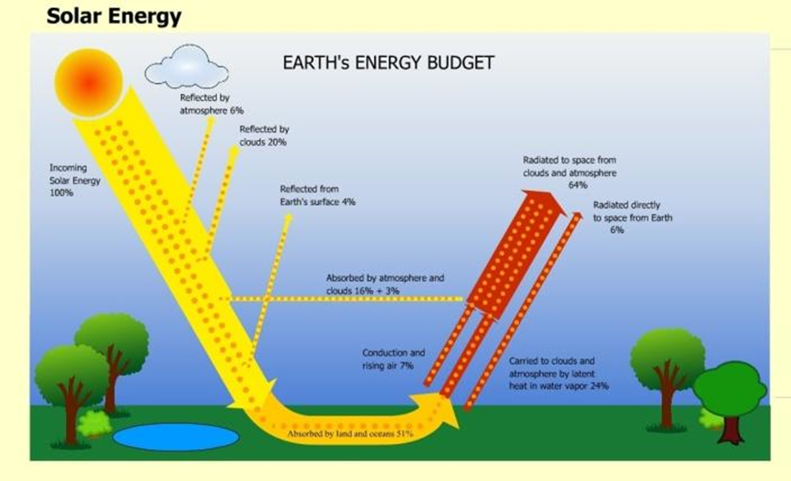

# 1.1: Earth's Sphere

1. Earth System: All the matter, energy, and processes within Earth's boundary
    1. Consists of non-living & living things.
        1. Example: Living things - Trees, animals, and people
        2. Example: Non-living things - Rocks, air, and water
    2. 5 main parts
        1. Geosphere: Mostly solid, rocky part of Earth
            1. Extends from the center of Earth
            2. 3 different layers
                1. Crust
                    1. 5 - 10 km thick (oceanic)
                    2. 35 - 70 km thick (continental)
                    3. Least dense
                    4. Mantle
                    5. 2,900 km thick
                    6. More dense than crust
                2. Core
                    1. 3,500 km thick
                    2. Most dense
        2. Hydrosphere: The part of Earth that is liquid water
            1. Includes marshes, ponds, lakes, water droplets, and rain
        3. Cryosphere: The part made up of all the frozen water on Earth.
            1. Includes ice, sea ice, glaciers, ice shelves, and icebergs
        4. Atmosphere: Mostly made up of invisible gases that surround Earth.
            1. 500 - 600 km of the Earth's surface
            2. Parts
                1. 78% nitrogen
                2. 21% oxygen
                3. 1% other gases, including argon, carbon dioxide, and water vapor
        5. Biosphere: The part of Earth made up of living things and the areas of Earth where they are found
            1. Rocks, soil, ocean, lakes, rivers, and lower atmosphere support life.
            2. Most organisms need water, and oxygen or carbon dioxide to live
    3. How the spheres interact
        1. Exchanging Matter: Earth's spheres interact as matter moves between spheres
            1. Example: Atmosphere →Hydrosphere or Cryosphere → clouds
        2. Exchanging Energy: Earth's spheres also interact as energy moves between them.
            1. Example: Plants use solar → generates food
    4. Source of Earth's energy
        1. Almost all the Earth's energy comes from the sun.
        2. Energy budget: A way to keep track of energy transfers into and out of the Earth system.
           1. Unbalancing the budget
              1. Can cause increase or decrease global temperatures, increase greenhouse gases, which makes us lose polar ice caps.
           2. Statistics
              1. Energy coming in
                  1. 26% Reflected by clouds & atmosphere
                  2. 4% Reflected by surface
                  3. 19% Absorbed by clouds and atmosphere
                  4. 51% absorbed by Earth
              2. Outgoing Energy
                  1. 64% radiated from atmosphere and clouds (19% came from absorption)
                  2. 7% lost as heat rising through the air
                  3. 23% evaporated from Earth to clouds
                  4. 6% radiated from Earth to space

