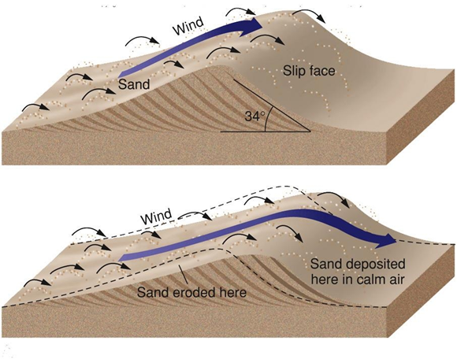

# 1.4: Erosion and Deposition with Wind

1. Abraded Rock: When wind blows sand against a surface, it can wear it down
    1. Results of this can lead to smooth, polished surfaces
2. Desert Pavement
    2. Deflation: The removal of sediment by wind.
    3. Wind removes sediments, but major rocks stay

        

3. Dunes
    4. Wind blows sediment on a small mound, dropping sediment on the mound
    5. Eventually, sediment builds up on the mound

        

4. Loess: Fine grained sediments that can be carried long distances by wind
2. Erosion and Deposition with Ice
5. Flowing Ice
    6. Glacial Drift: When a glacier leaves behind sediments it had carried
6. Alpine Glaciers: A glacier that forms in a mountainous area
    7. Landforms
        1. Can form U-shaped valleys
        2. Rivers form V-shaped valleys
        3. Cirques: A bowl shaped depressions where glacial ice cuts back into the mountain walls
        4. Arêtes: Jagged ridges that form between two or more cirques that cut into the same mountain
        5. Horns: Sharp, pyramid-shaped peaks that form when several arêtes join at the top of a mountain
        6. Hanging valleys: Small glacial valleys that join the deeper, main valley. [It may contain small waterfalls]
7. Continental Glaciers: Thick sheets of ice that may spread over large areas, including across entire continents
    8. Can erode and remove features that existed before the ice appeared
3. Erosion and Deposition with Gravity
8. Slow Mass Movement
    9. Creep: The extremely slow movement of material downslope
9. Rapid Mass Movement
    10. Rockfall: When loose rocks fall down a steep slope
    11. Landslide: A sudden and rapid movement of a large amount of material downslope
    12. Mudflow: When a large amount of water mixes with soil and rock [This can cause slippery mud to flow down a mountain side]