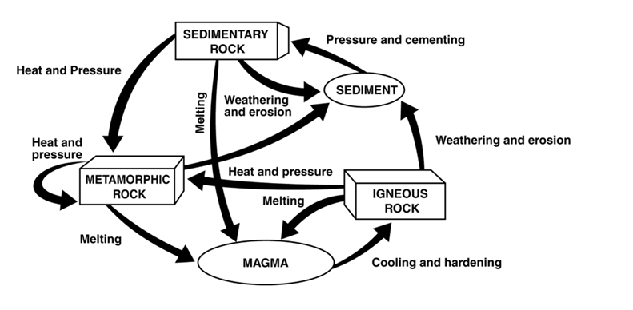

# Rock: 
1. A naturally occurring solid mixture of one or more minerals that may also include organic matter
2. Weathering: Weathering breaks rock into sediment
3. Erosion: Water, wind, ice, and gravity can erode sediments
4. Deposition: When sediment rests in one spot
5. Igneous Rock: When magma or lava cools and hardens into a rock
6. Sedimentary Rock: When sediments get cemented together
7. Metamorphic Rock: When pressure, temperature, or chemical processes change a rock
8. Rock Cycle

    

9. Uplift: Rising regions of crust to higher
10. Subsidence: When regions sink
11. Rift zone: Where cracks form in the ground allowing magma to spew out
