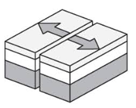
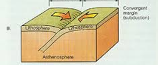
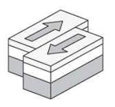

# 4.5: Earthquakes
1. Ground movements that occur when blocks of rock in Earth move suddenly and release energy
1. Focus: The place within earth along a fault at which first motion of an earthquake occurs
2. Epicenter: Directly above the focus
3. Boundaries
    1. Divergent Boundaries
        1. When tectonic plates move away from each other 

            

    2. Convergent Boundaries
        2. When tectonic plates squeeze each other 
       
            

    3. Transform Boundaries
        3. When Tectonic plates pass each other 
       
            