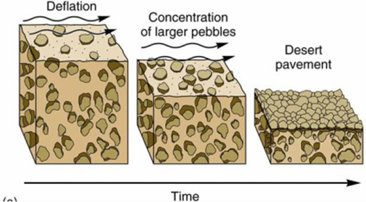
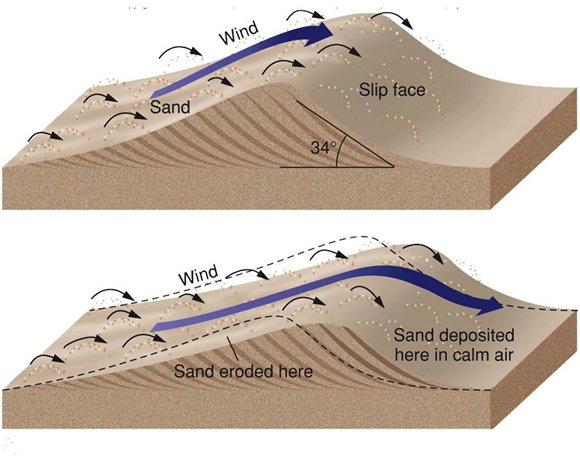

# Unit 1 Review

1. Earth's Sphere
    1. Earth System: All the matter, energy, and processes within Earth's boundary
        1. Consists of non-living & living things.
            1. Example: Living things - Trees, animals, and people
            2. Example: Non-living things - Rocks, air, and water
        2. 5 main parts
            3. Geosphere: Mostly solid, rocky part of Earth
                1. Extends from the center of Earth
                2. 3 different layers
                    1. Crust
                        1. 5 - 10 km thick (oceanic)
                        2. 35 - 70 km thick (continental)
                        3. Least dense
                    2. Mantle
                        4. 2,900 km thick
                        5. More dense than crust
                    3. Core
                        6. 3,500 km thick
                        7. Most dense
            4. Hydrosphere: The part of Earth that is liquid water
                3. Includes marshes, ponds, lakes, water droplets, and rain
            5. Cryosphere: The part made up of all the frozen water on Earth.
                4. Includes ice, sea ice, glaciers, ice shelves, and icebergs
            6. Atmosphere: Mostly made up of invisible gases that surround Earth.
                5. 500 - 600 km of the Earth's surface
                6. Parts
                    4. 78% nitrogen
                    5. 21% oxygen
                    6. 1% other gases, including argon, carbon dioxide, and water vapor
            7. Biosphere: The part of Earth made up of living things and the areas of Earth where they are found
                7. Rocks, soil, ocean, lakes, rivers, and lower atmosphere support life.
                8. Most organisms need water, and oxygen or carbon dioxide to live
        3. How the spheres interact
            8. Exchanging Matter: Earth's spheres interact as matter moves between spheres
                9. Example: Atmosphere →Hydrosphere or Cryosphere → clouds
            9. Exchanging Energy: Earth's spheres also interact as energy moves between them.
                10. Example: Plants use solar → generates food
        4. Source of Earth's energy
            10. Almost all the Earth's energy comes from the sun.
            11. Energy budget: A way to keep track of energy transfers into and out of the Earth system.
                11. Unbalancing the budget
                    7. Can cause increase or decrease global temperatures, increase greenhouse gases, which makes us lose polar ice caps.
                12. Statistics
                    8. Energy coming in
                        8. 26% Reflected by clouds & atmosphere
                        9. 4% Reflected by surface
                        10. 19% Absorbed by clouds and atmosphere
                        11. 51% absorbed by Earth
                    9. Outgoing Energy
                        12. 64% radiated from atmosphere and clouds (19% came from absorption)
                        13. 7% lost as heat rising through the air
                        14. 23% evaporated from Earth to clouds
                        15. 6% radiated from Earth to space
2. Weathering
    2. Physical Weathering
        5. Temperature Change [Ice Wedging]
            12. Water collects in cracks in rock
            13. Water freezes
            14. When frozen, it expanded, causing a crack
            15. Repeats over and over, until splitting the rock
        6. Pressure Change [Exfoliation]
            16. Pressure increases outer layers of the rock peel away
        7. Wind, Water, And Gravity [Abrasion]
            17. Wind
                13. Can blast particles away from object
            18. Water
                14. Rocks are tumbled and worn out in the running water
            19. Gravity
                15. Rocks can crack during landslides
        8. Plant Growth
            20. Root digs into a small crack in the wall
            21. Roots expands as the plant grows
            22. Bigger crack forms
    3. Chemical Weathering
        9. Oxygen Reactions [Oxidation]
            23. Different atoms combine with oxygen, making new materials
        10. Acid
            24. Precipitation
                16. Acid falls from the sky, burning rocks or objects in its path
            25. Groundwater
                17. Can burn minerals away from and object, depositing them somewhere else
            26. Living Things
                18. Plants can create acids, burning away the rock
3. Erosion: The process by which sediment and other materials are moved from one place to another
    4. Forms of Erosion
        11. Canyons & Valleys: When a flow of water through streams and rivers erode rock from the streambed
        12. Caves: Water erodes the rock, eventually forming a cave
        13. Sea Cliffs: When waves erode and undercut rock to make steep slopes
        14. Wave cut platforms: When sea cliffs erode so much that the they are flat
        15. Sea Caves: When the bottom of sea cliffs erode faster than the top
        16. Sea Arches: When a sea cave erodes all the way to the other side, forming a hole
        17. Sea stacks: When a sea arch collapses, it leaves behind pillars of rock
4. Deposition: The process by which eroded material is dropped
    5. Forms of Deposition
        18. Floodplains: When sediment is dropped over a flooded land
        19. Deltas: Streams deposit sediment in a fan-shaped pattern
        20. Alluvial Fan: A dry fan-shaped pattern of sediment
        21. Beaches: Particles can come up on a beach
5. Erosion and Deposition with Wind
    6. Abraded Rock: When wind blows sand against a surface, it can wear it down
        22. Results of this can lead to smooth, polished surfaces
    7. Desert Pavement
        23. Deflation: The removal of sediment by wind.
        24. Wind removes sediments, but major rocks stay

        

    8. Dunes
        25. Wind blows sediment on a small mound, dropping sediment on the mound
        26. Eventually, sediment builds up on the mound

        

    9. Loess: Fine grained sediments that can be carried long distances by wind
6. Erosion and Deposition with Ice
    10. Flowing Ice
        27. Glacial Drift: When a glacier leaves behind sediments it had carried
    11. Alpine Glaciers: A glacier that forms in a mountainous area
        28. Landforms
            27. Can form U-shaped valleys
            28. Rivers form V-shaped valleys
            29. Cirques: A bowl shaped depressions where glacial ice cuts back into the mountain walls
            30. Arêtes: Jagged ridges that form between two or more cirques that cut into the same mountain
            31. Horns: Sharp, pyramid-shaped peaks that form when several arêtes join at the top of a mountain
            32. Hanging valleys: Small glacial valleys that join the deeper, main valley. [It may contain small waterfalls]
    12. Continental Glaciers: Thick sheets of ice that may spread over large areas, including across entire continents
        29. Can erode and remove features that existed before the ice appeared
7. Erosion and Deposition with Gravity
    13. Slow Mass Movement
        30. Creep: The extremely slow movement of material downslope
    14. Rapid Mass Movement
        31. Rockfall: When loose rocks fall down a steep slope
        32. Landslide: A sudden and rapid movement of a large amount of material downslope
        33. Mudflow: When a large amount of water mixes with soil and rock [This can cause slippery mud to flow down a mountain side]

## Gas Giants and The Solar Eclipse

### Gas Giants

* Gas Giants have deep,massive gas atmospheres,which are made up mostly of hydrogen and helium
* Saturn is the least dense planet made up of mostly made up of hydrogen and helium.It could float on water.
* Jupiter is the largest planet in the solar system.It’s volume can contain more than 900 Earths.It’s mass is twice the other planets combined.
* Uranus and Neptune will not be included in the test
* Gas giants gas become denser as you move in
* Saturn is the second largest planet after Jupiter and has giant rings that are huge!

### Solar Eclipses

* You can only see the solar eclipse during the day time
* Solar Eclipses happen when the moon blocks the Sun from view the daytime.
* The Solar Eclipse generally happens about two weeks after a lunar eclipse
* The Solar eclipse happens when the sun,moon,and earth are aligned
* A solar eclipse happens at a new moon

## Earth's Spheres and Weathering

### Lesson 1: Earth’s Spheres

- Earth’s system: is all the matter energy,process,within earth’s boundary
- Geosphere:All the rock and minerals in the Earth.
- Hydrosphere: The portion of Earth that is water.
- Cryosphere: All the ice and frozen water is the Earth.
- Atmosphere: A mixture of gases that surrounds a planet, moon, or other celestial body.
- Biosphere:All the living things in the Earth.
- Energy budget: The net flow of energy into and out of a system.

### Lesson 2: Weathering

- Weathering: is the break of rock minerals by physical and chemical
- Physical weathering: The mechanical breakdown of rocks into smaller pieces that is caused by natural processes and that does not change the chemical composition of the rock material
- Ice wedging: when water gets in small cracks in rocks then freezes and the water expands.
- Exfoliation:Exfoliation is when the snow/pressure is removed from the rocks, allowing the rocks to bounce back up.
- Abrasion:  The process by which rock is reduced in size by the scraping action of of other rocks driven by water, wind, and gravity
- Chemical weathering:The breakdown of rocks from chemical reactions.
- Oxidation: A chemical reaction in which material combines with oxygen to form new material; in geology, oxidation is a form of chemical weathering
- Acid precipitation and give one example: Rain, sleet, or snow that contains a high contains a high concentration of acids
- Stalactites: Are rocks hanging from the top of the cave that is created by chemical and water
- Stalagmites: Are racks that are created from the dripping water