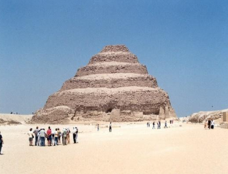
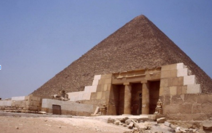

# Egypt Pyramids

Please describe the picture:
Who: Imhotep
What: The Pyramid of Djoser
Where:	 The necropolis of Saqqarah in Memphis
When: Between 2670 B.C - 2650 B.C
Why: To be the burial place of King Djoser

Using the information above, write a comprehensive paragraph about this pyramid picture.  Be sure to include a topic and conclusion sentence:

The Pyramid of Djoser, built by the ancient Egyptians, is a monument that still stands to this day. The step pyramid is thought to be built between 2670 B.C - 2650 B.C, and was thought to be designed by Imhotep, who was an Egyptian architect. It was built at the necropolis of Saqqarah in Memphis, its purpose was to be the final burial place of King Djoser. The Pyramid of Djoser still stands today and is a popular place for tourists.

Please describe the picture:
Who: Khafre
What: Khafre's Pyramid
Where: Southwest of the Great Pyramid of Cheops
When: Around 2570 B.C
Why: To be the burial place of Khafre

Using the information above, write a comprehensive paragraph about this pyramid picture.  Be sure to include a topic and conclusion sentence:

Khafre's Pyramid, built by the ancient Egyptians, is a monument that still stands to this day. The step pyramid is thought to be built around 2570 B.C, and was built by Khafre himself. It is located southwest of the Great Pyramid of Cheops, its purpose was to be the final burial place of Khafre. Khafre's Pyramid still stands today and is a popular place for tourists.
